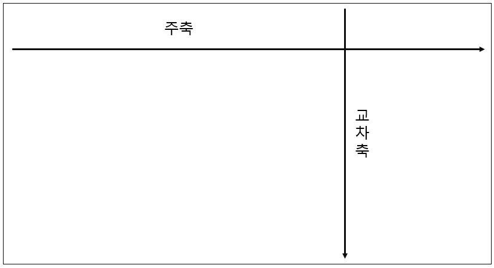

## 1. Flexbox 란?

Flexbox 를 사용하면, 사용자 화면의 알 수 없는 크기의 요소 간에 공간을 동적으로 분배할 수 있다.

Flexbox 의 공간에 요소를 배치하기 위해서는 '주축'과 '교차축' 을 이해하도록 하자.

주축의 기본방향은 '좌 > 우' 이고, 교차축의 기본방향은 '상 > 하' 이다.


## 2. flex-direction

flexbox 내의 아이템을 배치할 때, 사용할 주축 및 방향(정방향, 역방향)을 지정한다. 주축의 기본 방향은 '좌 > 우' 이다.

요소를 flexbox로 지정하기 위해서는 스타일에 display:flex; 를 반드시 포함해야,  아이템들의 배치를 위한 flex-direction 을 지정할 수 있으니 기억해두자.

flexbox의 크기에 따라 아이템의 크기도 조절되니 기억해두자.

```css
/* FlexBox */
section {
...
    /* section을 flexbox로 적용 */
    display: flex;

    /* 요소의 순서대로 가로방향으로 정렬 */
    flex-direction: row;

    /* 요소의 역순으로 가로방향으로 정렬 */
    flex-direction: row-reverse;

    /* 요소의 순서대로 세로방향으로 정렬 */
    flex-direction: column;

    /* 요소의 역순으로 세로방향으로 정렬 */
    flex-direction: column-reverse;
}
```


## 3. justify-content

display: flex; 와 flex-direction 이 반드시 선행되어야 적용할 수 있다.

그리고 flex-direction 의 방향에 따라 아래와 같은 정렬을 적용할 수 있다. 

- justify-content: flex-start; 는 좌 > 우 정렬.
- justify-content: flex-end; 는 우 > 좌 정렬.
- justify-content: center; 는 중앙 정렬.
- justify-content: space-between; 은 바깥쪽 여백을 다 없애고, 요소 사이의 공간만 띄어서 정렬.
- justify-content: space-evenly; 는 요소 사이, 요소와 컨테이너 사이에도 동일한 크기의 여백으로 정렬.
- justify-content: space-around; 는 요소의 여백을 똑같은 크기로 정렬.

```css
section {
...
    /* 좌 > 우 정렬 */
    justify-content: flex-start;

    /* 우 > 좌 정렬 */
    justify-content: flex-end;

    /* 중앙 정렬 */
    justify-content: center;

    /* 바깥쪽 여백을 다 없애고, 요소 사이의 공간만 띄어서 정렬 */
    justify-content: space-between;

    /* 요소 사이, 요소와 컨테이너 사이에도 동일한 크기의 여백으로 정렬 */
    justify-content: space-evenly;

    /* 요소의 여백을 똑같은 크기로 정렬 */
    justify-content: space-around;
}
```


## 4. flex-wrap

교차축의 방향으로 요소를 정렬할 수 있다.

예를 들어, 주축이 가로방향이면 교차축은 세로방향이 되고, 반대일 경우도 마찬가지이다.

-  flex-wrap: wrap 과 flex-wrap: wrap-reverse 의 차이는 교차축의 반전이다.

**[flex-wrap: wrap]**



**[flex-wrap: wrap-reverse]**


