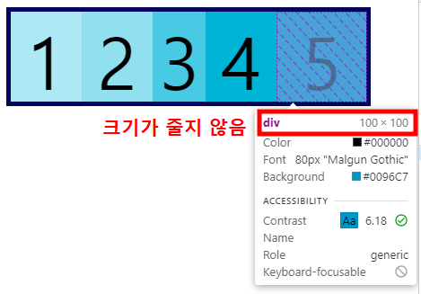

## 1. flexbox 란?

flexbox 를 사용하면, 사용자 화면의 알 수 없는 크기의 요소 간에 공간을 동적으로 분배할 수 있다.

flexbox 의 공간에 요소를 배치하기 위해서는 '주축'과 '교차축' 을 이해하도록 하자.

주축의 기본방향은 '좌 > 우' 이고, 교차축의 기본방향은 '상 > 하' 이다.


## 2. flex-direction

flexbox 내의 아이템을 배치할 때, 사용할 주축 및 방향(정방향, 역방향)을 지정한다. 주축의 기본 방향은 '좌 > 우' 이다.

요소를 flexbox로 지정하기 위해서는 스타일에 display:flex; 를 반드시 포함해야,  아이템들의 배치를 위한 flex-direction 을 지정할 수 있으니 기억해두자.

flexbox의 크기에 따라 아이템의 크기도 조절되니 기억해두자.

```css
/* FlexBox */
section {
...
    /* section을 flexbox로 적용 */
    display: flex;

    /* 요소의 순서대로 가로방향으로 정렬 */
    flex-direction: row;

    /* 요소의 역순으로 가로방향으로 정렬 */
    flex-direction: row-reverse;

    /* 요소의 순서대로 세로방향으로 정렬 */
    flex-direction: column;

    /* 요소의 역순으로 세로방향으로 정렬 */
    flex-direction: column-reverse;
}
```


## 3. justify-content

display: flex; 와 flex-direction 이 반드시 선행되어야 적용할 수 있다.

그리고 flex-direction 의 방향에 따라 아래와 같은 정렬을 적용할 수 있다. 

- justify-content: flex-start; 는 좌 > 우 정렬.
- justify-content: flex-end; 는 우 > 좌 정렬.
- justify-content: center; 는 중앙 정렬.
- justify-content: space-between; 은 바깥쪽 여백을 다 없애고, 요소 사이의 공간만 띄어서 정렬.
- justify-content: space-evenly; 는 요소 사이, 요소와 컨테이너 사이에도 동일한 크기의 여백으로 정렬.
- justify-content: space-around; 는 요소의 여백을 똑같은 크기로 정렬.

```css
section {
...
    /* 좌 > 우 정렬 */
    justify-content: flex-start;

    /* 우 > 좌 정렬 */
    justify-content: flex-end;

    /* 중앙 정렬 */
    justify-content: center;

    /* 바깥쪽 여백을 다 없애고, 요소 사이의 공간만 띄어서 정렬 */
    justify-content: space-between;

    /* 요소 사이, 요소와 컨테이너 사이에도 동일한 크기의 여백으로 정렬 */
    justify-content: space-evenly;

    /* 요소의 여백을 똑같은 크기로 정렬 */
    justify-content: space-around;
}
```


## 4. flex-wrap

교차축의 방향으로 요소를 '줄바꿈'할 수 있다.

예를 들어, 주축이 가로방향이면 교차축은 세로방향이 되고 반대로 주축이 세로방향이면 교차축은 가로방향이 된다.

-  flex-wrap: wrap 과 flex-wrap: wrap-reverse 의 차이는 줄바꿈 방향의 반전이다.

**[flex-wrap: wrap]**


**[flex-wrap: wrap-reverse]**


```css
section {
...
    /* 줄바꿈 방향을 교차축 방향(상 > 하)로 설정*/
    flex-wrap: wrap;

    /* 줄바꿈 방향을 교차축 방향(하 > 상)로 설정*/
    flex-wrap: wrap-reverse;
}
```


## 5. align-items

교차축을 기준으로 컨테이너의 최상당, 최하단, 중앙의 위치에 정렬할 수 있다.

- align-items: flex-start 와 align-items: flex-end 의 차이는 컨테이너의 최상단에 정렬할 것인지 아니면 최하단에 정렬할 것인지의 차이이다.

```css
/* 컨테이너의 중앙, 줄바꿈(상>하) */
align-items: center;
flex-wrap: wrap;
```


```css
/* 컨테이너의 최상단, 줄바꿈(상>하) */
align-items: flex-start;
flex-wrap: wrap;
```


```css
/* 컨테이너의 최하단, 줄바꿈(상>하) */
align-items: flex-end;
flex-wrap: wrap;
```


## 6. align-content & align-self

align-content 도 align-items 와 마찬가지로 교차축을 기준으로 정렬하지만, 아래와 같은 차이가 있다.

- align-items: flex line 을 기준으로 아이템을 정렬한다.
- align-content: flex line 자체를 정렬한다.
- align-self: 지정한 요소만 교차축을 기준으로 정렬한다.

```css
/* flex line 을 기준으로 아이템을 정렬한다. */
align-items: center;
```


```css
/* flex line 자체를 정렬한다. */
align-content: center;
```


```css
...
/* 첫번째 박스만 최하단에 정렬 */
.align-self div:nth-of-type(1) {
    background-color: #ade8f4;
    align-self: flex-end;
}

.align-self div:nth-of-type(2) {
    background-color: #90e0ef;
}

/* 세번째 박스만 최하단에 정렬 */
.align-self div:nth-of-type(3) {
    background-color: #48cae4;
    align-self: flex-start;
}
...
```


## 7. flex-basis, flex-grow & shrink

- flex-basis:처음 실행되는 페이지에서 보여지는 크기를 설정할 수 있다. 주축의 방향(flex-direction)에 따라 너비도 되고 높이도 될 수 있으며, widht 와 flex-basis 를 같이 사용하면, width 가 적용되지 않는다.

```css
div {
 ...
 	/* flex-basis 와 width 를 함께 사용하면, widht 적용안됨. */
    width: 50px;
    /* 처음 실행되는 화면에서 200px 만큼 너비 적용 */
    flex-basis: 100px;
}
```

- flex-grow: 지정한 요소가 화면의 남는 크기를 비율로 차지하게끔 적용할 수 있다.

```css
div:nth-of-type(1) {
    background-color: #ade8f4;
    /* 남는 화면의 크기를 첫번째 박스와 두번째 박스가 1:2 비율로 가져감 */
    flex-grow: 1;
}

div:nth-of-type(2) {
    background-color: #90e0ef;
    /* 남는 화면의 크기를 첫번째 박스와 두번째 박스가 1:2 비율로 가져감 */
    flex-grow: 2;
}
```


- flex-shrink: 화면의 크기가 줄어들 때, 다른 요소에 비해 얼마나 더 줄어들지 설정할 수 있다. 만약, flex-shrink:0; 을 사용하면, 화면의 크기가 줄어들더라도 요소의 크기를 항상 유지할 수 있다.

```css
div:nth-of-type(3) {
    background-color: #48cae4;
    /* 화면의 크기가 줄어들더라도 다른 요소에 비해 2만큼 더 줄어들게 함 */
    flex-shrink: 2;
}

...

div:nth-of-type(5) {
    background-color: #0096c7;
    /* 화면의 크기가 줄어들더라도 줄어들지 않음 */
    flex-shrink: 0;
}
```




## 8. flex 속기법

```css
/* Two values: flex-grow | flex-basis */
flex: 1 30px;

/* Two values: flex-grow | flex-shrink */
flex: 2 2;

/* Three values: flex-grow | flex-shrink | flex-basis */
flex: 2 2 10%;
```


## 9. 미디어 쿼리

사용자의 다양한 화면 크기(모니터, 스마트 폰 등) 또는 가로모드 등 다양한 디바이스 환경에서 작동하도록 '미디어 쿼리'를 지정하면, 해당 쿼리를 만족하는 장치에서만 스타일이 작동하게 할 수 있다.

```css

/* 화면 크기가 최소 800px 보다 커야만 스타일 적용  */
@media (min-width: 800px) {
    h1 {
        color: red;
    }
}

/* 화면 크기가 최대 800px 보다 작아야만 스타일 적용  */
@media (max-width: 800px) {
    h2 {
        color: red;
    }
}

/* 화면 크기가 900px ~ 1200px 사이에서만 스타일 적용 */
@media (min-width: 900px) and (max-width: 1200px)
{
    h3 {
        color: magenta
    }
}

/* 디바이스가 가로모드일 때에만 작동 */
@media (orientation: landscape)
{
    h4 {
        color: blue
    }
}
```

