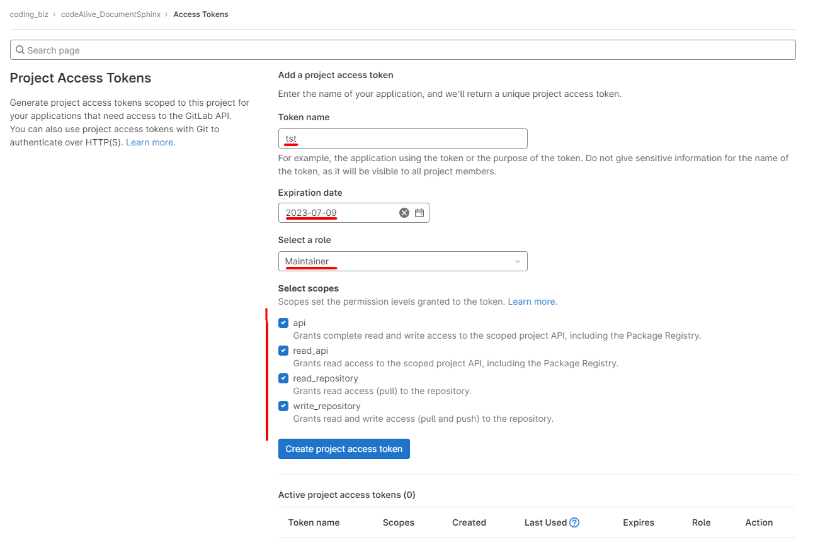

- node-modules gitgnore 에 추가
- build 경로 gitgnore 에 추가

gitgnore 관련 링크: https://kcmschool.com/194

## 1. Gitlab 프로젝트 생성

순서 1. Gitlab 접속 > Projects > Your projects > New project > Create blank project/repository

순서 2. Project name 작성 > Project URL 확인 후 Create project 선택


## 2. 로컬 PC에 git 연결

로컬 경로에서 git bash 실행하여 아래 순서에 따라 실행.

```c
git init
git remote add origin {your URL}
git branch -M master
git add .
git status
git commit -m "메시지"
git push -uf origin master
```


## 3. 깃랩 사용시 주의사항

### 1. ssl certificate problem: unable to get local issuer certificate 에러 로그 해결

(단, 보안에 문제가 발생할 수 있으니, 올리는대로 다시 끄는걸 추천한다고 함)

```c
git config --global http.sslVerify false
```


### 2. 깃랩에서 Access Token 발급 받는 법

깃랩 홈페이지 > Settings > Access Token > 모든 값 입력 > Scopes 모두 체크 > Create project access token 활성화되면  token 생성 > 토큰 복사



### 3. gitlab: you are not allowed to force push code to a protected branch on this project. 에러 로그 해결

깃랩 홈페이지 > GitLab Project > Settings > Repository > Protected Branches -> Expand 버튼 클릭.

하단에 Protected Branches 리스트에 우측 UnProtected를 클릭.

[참고 링크](https://ipex.tistory.com/entry/GitLab-You-are-not-allowed-to-push-code-to-protected-branches-on-this-project)