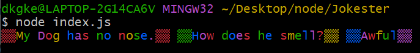

## 1. Node.js 란?

- 브라우저 밖에서 작동되는 javaScript이다. 즉, 서버 측에서 실행되는 코드를 작성할 수 있다.
- Node 는 브라우저의 페이지 개발에 필요했던 문서와 API, 라이브러리를 제공하지 않는다. 대신에, 브라우저에 없는 os와 파일, 폴더 등과 상호작용 할 수 있는 기능들을 제공한다.


## 2. Node 설치 방법

- 링크: https://nodejs.org/en/


## 3. Node 사용법

- **순서 1)** git bash를 실행하고 명령창에 node 를 입력한다. node로 진입하면, javascript의 REPL 상태로 넘어간다. REPL 상태는 브라우저 콘솔과 비슷한 기능을 한다고 보면된다. 

```bash
node
```


- **순서 2)** '.help' 를 입력하면, node로 os를 다룰 수 있는 명령어를 확인할 수 있다.

```bash
## 입력 ##
.help

## 출력 ##
.break    Sometimes you get stuck, this gets you out
.clear    Alias for .break
.editor   Enter editor mode
.exit     Exit the REPL
.help     Print this help message
.load     Load JS from a file into the REPL session
.save     Save all evaluated commands in this REPL session to a file
```


**순서 3)** 'global' 을 입력하면, 브러우저에서 사용할 수 없었던 timeout이나 interval을 사용할 수 있다.

```bash
## 입력 ##
global

## 출력 ##
<ref *1> Object [global] {
  global: [Circular *1],
  clearInterval: [Function: clearInterval],
  clearTimeout: [Function: clearTimeout],
  setInterval: [Function: setInterval],
  setTimeout: [Function: setTimeout] {
    [Symbol(nodejs.util.promisify.custom)]: [Getter]
  },
  queueMicrotask: [Function: queueMicrotask],
  performance: Performance {
    nodeTiming: PerformanceNodeTiming {
      name: 'node',
      entryType: 'node',
      startTime: 0,
      duration: 105384.9251999855,
      nodeStart: 0.5079998970031738,
      v8Start: 2.7219998836517334,
      bootstrapComplete: 23.479899883270264,
      environment: 11.964900016784668,
      loopStart: 44.110299825668335,
      loopExit: -1,
      idleTime: 105244.0618
    },
    timeOrigin: 1675132101585.149
  },
  clearImmediate: [Function: clearImmediate],
  setImmediate: [Function: setImmediate] {
    [Symbol(nodejs.util.promisify.custom)]: [Getter]
  }
}
```


**순서 4)** 아래와 같이 3초 후에 hello가 출력되게 할 수도 있다.

```bash
## 입력 ##
setTimeout(()=>console.log("hello"), 3000)

## (3초 후) 출력 ##
hello
```


## 4. Node 파일 생성하고 실행하는 법

- **순서 1)** git bash 디폴트 창으로 진입하여, 원하는 경로에 파일을 생성한다.

```bash
# 바탕화면에 폴더(node) 생성 > js 파일(firstscript) 생성
mkdir node
cd node
touch firstScript.js
```


- **순서 2)** VS code에서 해당 파일을 열어 코드를 작성한다. 아래는 예시로 작성한 코드이다.

[ firstscript.js ]

```javascript
// VS code에서 js로 작성한 코드
for (let i = 0; i < 10; ++i) {
    console.log(`hi_${i}`)
}
```


- **순서 3)** 파일이 있는 경로에서 아래와 같은 방식으로 실행한다.

```bash
# node + 실행파일명
node firstScript.js

## 출력 ##
hi_0
hi_1
hi_2
hi_3
hi_4
hi_5
hi_6
hi_7
hi_8
hi_9
```


## 5. Express 가 없는 Node 에서 인수 전달하는 방법 - Process & argv

- node 에서는 다양한 모듈을 제공하는데, 이 모듈의 docs를 보기 위해서는 설치된 node의 버전을 체크하자.

```bash
# node 버전 확인
node -v

## 출력 ##
v16.17.0
```


- **순서 2)** 아래 링크를 통해 위에서 확인한 버전의 모듈 docs를 확인할 수 있다.

링크 : https://nodejs.org/en/docs/


- **순서 3)** docs에서 Process 모듈을 찾아보면, process 는 현재 Node.js 프로세스에 관한 정보, 제어를 제공한다고 한다.

링크 : https://nodejs.org/docs/latest-v16.x/api/process.html


- **순서 4)** git bash에서 process를 아래와 같이 사용할 수 있다.

```bash
# process 모듈이 제공하는 정보를 전부 출력
process

# process 버전 확인
process.version

# process 릴리즈 정보 확인
process.release

# 현재 작업 위치나 현재 실행하는 Node를 수 있음
process.cwd()
```


- **순서 5)** process.argv로 전달된 인수의 자료형과 값을 확인하기 위해, 아래와 같이 argvScript.js를 생성한다.

[ argvScript.js ]

```javascript
// node에서 전달받은 인수(process.argv)를 변수(data)에 저장
let data = process.argv

console.log(typeof(data))
console.log(data)
```


- **순서 6)** git bash 에서 'node argvScript.js red green' 을 입력하여 실행하면, 아래와 같은 결과가 출력된다.
- 아래 출력결과를 통해 알 수 있는 점은, process.argv의 자료형이 객체라는 것과 두번째 인덱스부터 인수가 전달됨을 확인할 수 있다.

```bash
## 입력 ##
node argvScript.js red green

## 출력 ##
object
[
  'C:\\Program Files\\nodejs\\node.exe',
  'C:\\Users\\dkgke\\Desktop\\node\\argvScript.js',
  'red',
  'green'
]
```


- **순서 7)** 위 코드를 응용하여 아래와 같이 전달받은 인수만을 출력할 수 있다.

[ fruits.js ]

```javascript
// 2번째부터 인수를 받아 data 저장
let data = process.argv.slice(2);

for (let i of data) {
    console.log(i);
}
```

[ git bash ]

```bash
## 입력 ##
node fruits.js apple orange grape banana

## 출력 ##
apple
orange
grape
banana
```


## 6. Node 모듈(File System) 사용하기

### 동기와 비동기 방식

- 파일을 읽거나 폴더를 생성하는 메서드, 파일이나 폴더를 삭제하는 메서드는 아래와 같이 두가지 방식(동기와 비동기)이 있다.

  - **동기 방식**: 동기 메서드는 작업이 끝날 때까지 모든 프로세스를 차단한다. 그래서 다른 코드의 실행을 막지만 로직이 쉬워지고, 콜백을 신경쓰지 않아도 된다.

  ```javascript
  const fs = require('fs');
  
  // 동기 방식 메소드(mkdirSync)
  // node 실행경로에 'Flower' 폴더 생성
  fs.mkdirSync('Flower');
  console.log("I COME AFTER MKDIR IN THE FILE")
  ```

  ```javascript
  const fs = require('fs');
  
  // node 에서 인수로 전달받은 값을 폴더명으로 저장
  // default 명은 'Temp'로 저장
  let folderName = process.argv[2] || 'Temp'
  
  try {
  // folderName 명으로 폴더 생성
  fs.mkdirSync(folderName);
  // 위 경로에 index.html, app.js, style.css 생성
  fs.writeFileSync(`${folderName}/index.html`);
  fs.writeFileSync(`${folderName}/app.js`);
  fs.writeFileSync(`${folderName}/style.css`);
  } catch (e) {
      console.log("Error");
      console.log(e);
  }
  ```

  

  - **비동기 방식**: 콜백을 신경써야하며 결과가 주어지는데 시간이 걸리더라도 그 시간 동안 다른 작업을 할 수 있어 효율적으로 사용할 수 있는 장점이 있다.

  ```javascript
  const fs = require('fs');
  
  // 비동기 방식 메소드(mkdir)
  // node 실행경로에 'Tree' 폴더 생성
  fs.mkdir('Tree', { recursive: true }, (err) => {
      console.log("In the callback")
      if (err) throw err;
  })
  ```


## 7. Module.exports 사용하기

- Node 내장 모듈 뿐만 아니라, 다른 파일에서 코드를 불러올 수 있다.

[ math.js ]

- 내보낼 모듈

```javascript
const add = (x, y) => x+y;

const PI = 3.141592;

const square = x => x*x;

// module.exports 객체에 순서대로 함수명으로 지정, 정의
module.exports.add = add;
module.exports.PI = PI;
module.exports.square = square;
```


[ app.js ]

- math 모듈을 사용할 파일

```javascript
// ./ 같은 경로에 있음을 지칭
const { add, PI, square } = require('./math')

console.log(add(1, 2));
console.log(PI);
console.log(square(3));
```


[ gitbash ]

```bash
$ node app.js

3
3.141592
9
```


## 8. 디렉터리의 필요성

- 프로젝트 구조

  /node

  - app.js

    

    /fruits

    - index.js

    - apple.js
    - orange.js
    - grape.js

    

- 여러 모듈(apple.js, orange.js, grape.js)의 디렉터리를 index.js에서 합쳐, 상위 경로에 있는 app.js 에서 합친 모듈을 아래와 같이 합쳐 사용해보도록 하자.

[ index.js ]

```javascript
const apple = require("./apple")
const grape = require("./grape")
const orange = require("./orange")

const allFruits = [apple, grape, orange]

module.exports = allFruits;
```


[ apple.js ]

```javascript
const apple = {
    color: "red",
    price: 1500
}

module.exports.apple = apple;
```


[ grape.js ]

```javascript
const grape = {
    color: "violet",
    price: 6700
}

module.exports.grape = grape;
```


[ orange.js ]

```javascript
const orange = {
    color: "orange",
    price: 2900
}

module.exports.orange = orange;
```


[ app.js ]

```javascript
const allFruits = require("./fruits/index")

for (fruit of allFruits) {
    console.log(fruit);
}
```


[ gitbash ]

```bash
$ node app.js

{ apple: { color: 'red', price: 1500 } }
{ grape: { color: 'violet', price: 6700 } }
{ orange: { color: 'orange', price: 2900 } }
```


## 9. NPM 으로 라이브러리 설치하기

- npm 링크: https://www.npmjs.com/

- NPM으로 프로젝트에 필요한 라이브러리를 편리하게 설치, 추가, 사용할 수 있다.
- 예시로 [give-me-a-joke 라이브러리](https://www.npmjs.com/package/give-me-a-joke)와 [colors 라이브러리](https://www.npmjs.com/package/colors)를 설치하여 파일에 추가하여 사용한 순서는 아래와 같다.

- **순서 1)** 라이브러리를 설치하고 싶은 경로에서 git bash를 통해 해당 라이브러리를 설치한다.

```bash
$ npm install give-me-a-joke
$ npm install colors
```


- **순서 2)** 라이브러리 문서를 참고하여 아래와 같이 코드를 작성하고 gitbash에서 실행해본다.

[ index.js ]

```javascript
const joker = require('give-me-a-joke')
const colors = require('colors')

joker.getRandomDadJoke ((joke) => {
    console.log(colors.rainbow(joke))
});
```


[ git bash ]




## 10. NPM 전역 설치와 지역 설치

-  NPM 으로 패키지를 설치할 때, 패키지가 필요한 디렉터리로 접근하여 설치했지만, 자주 사용하는 패키지의 경우 전역 설치해서 사용할 필요가 있다. 전역 설치와 지역 설치 명령어이다.
- **전역 설치** **:**

```bash
npm install -g cowsay
```

- 전역 설치된 모듈이 설치된 경로

```bash
c:/Users/dkgke/AppData/Roaming/npm/node_modules/
```

- 전역 설치된 모듈 사용 예시

```javascript
// 전역 설치된 모듈의 디폴트 경로
const moduleGlobalPath = 'c:/Users/dkgke/AppData/Roaming/npm/node_modules/'
// '모듈의 이름/index'로 라이브러리에 접근
const cowsayPath = moduleGlobalPath + 'cowsay/index'

const cowsay = require(cowsayPath);

console.log(cowsay.say({
    text : "I'm a moooodule",
    e : "oO",
    T : "U "
}));
```


## 11. npm install 프로젝트에 다른 package.json 의 dependecies 설치하기

- package.json > dependencies 의 프로젝트에 사용하기 위해 다운로드받아 설치된 모듈의 목록을 확인할 수 있다. 만약 다른 프로젝트나 다른 환경에서 해당 프로젝트의 모듈을 다운로드 받기 위해서는 package.json과 npm install을 사용하면, 쉽게 모듈을 전부 다운로드 받을 수 있다.

```bash
npm install
```


