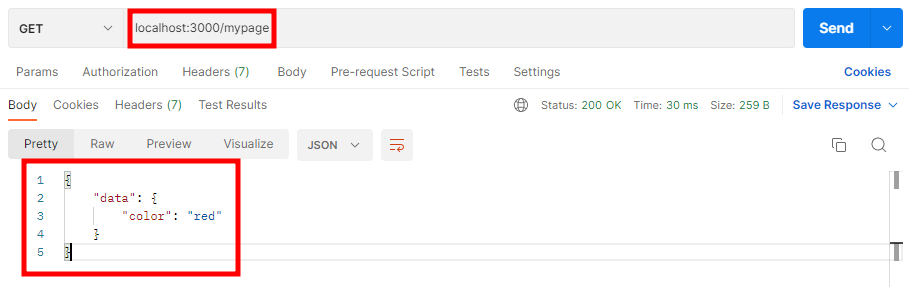

## 1. Express 란?

- Express 는 node 패키지인데, 웹 애플리케이션 제작을 도와주는 웹 개발 프레임워크이다. (내가 프론트에서 사용했던, React도 node 패키지 중 하나였다는 사실을 이제야... 알게 되었다. 기회가 된다면, node를 깊이 있게 파야 할 것 같다.)
- Express 링크 : https://expressjs.com/ko/


## 2. Express 가 하는일

- 클라이언트로부터 requests를 받아들이는 서버를 구축할 수 있다.
- 이 때, 요청을 파싱해야 되는데, HTTP 요청이 텍스트 정보이기 때문에 JavaScript 객체가 아니라 분석할 수 없다. 이를 Express가 돕는데, 정보를 요청으로 변환하고 이 요청을 객체로 변환하는 기능을 제공한다.
- API 에 사용되는 끝자리 route (예: /home, /myPAge)를 분석하여 어떤 요청인지에 따라 실행되는 다양한 코드와 함수를 작성할 수 있다.
- 응답을 만드는 것도 도와주는데 상태 코드를 설정할 수 있고 헤더와 같은 콘텐츠를 어떻게 응답할지 설정할 수 있다.


## 3. Express 환경 셋팅

- **순서 1)** 원하는 디렉터리에 파일을 생성하고, npm init -y 를 통해, package.json 파일을 생성한다.

```bash
# 해당 디렉터리에 package.json 파일을 생성
npm init -y
```


**순서 2)** Express 패키지를 설치한다.

```bash
npm install express
```


## 4. Express 첫 서버 만들기

- 클라이언트의 요청을 리스닝하고 접근 요청했을 때,  콘솔창에서 접근 요청 메세지를 출력하는 앱을 만들어보자
- **순서 1)**  로컬의 3000번 포트에서 클라이언트의 요청을 리스닝하는 코드를 작성한다.

[ firstApp.js ]

```javascript
// express 모듈
const express = require('express');
const app = express()
// 서버와 포트 주소
const port = 3000

// 클라이언트로부터 접근 요청을 받으면, 'Welcome!'으로 응답
app.get('/', (req, res) => {
    res.send('Welcome!')
})

// port로 서버 시작, 콘솔에 Listening 출력
app.listen(port, () => {
    console.log('Listening...')
})
```


- **순서 2)** 아래 코드를 통해 express 객체에서 제공하는 메소드를 살펴볼 수 있으니, 참고하도록 하자.

[ firstApp.js ]

```javascript
const express = require('express');
const app = express()
const port = 3000

app.get('/mypage', (req, res) => {
    console.dir(req)
})

app.listen(port, () => {
    console.log('Listening...')
})
```


## 5. Express 요청(req), 응답(res) 객체

- 클라이언트의 리퀘스트를 get할 때, 콜백함수의 매개변수로 req와 res가 필요한데 기능은 아래와 같다.
  - 요청(req): HTTP로 들어온 정보를 자바스크립트의 객체 정보로 확인할 수 있게 한다.
  - 응답(res): 요청을 한 누군가에게 보내질 응답을 생성하는 데 사용할 수 있다.


- 요청(req)에서 제공하는 객체 정보를 확인하는 방법과 출력결과이다.

[ firstApp.js ]

```javascript
const express = require('express');
const app = express()
const port = 3000

app.get('/mypage', (req, res) => {
    // 클라이언트의 요청 객체(req) 정보 출력
    console.dir(req)
})

app.listen(port, () => {
    console.log('Listening...')
})
```


- res.send()를 통해, 요청한 클라이언트에게 반환할 값을 셋팅할 수 있다.

[ firstApp.js ]

```javascript
const express = require('express');
const app = express()
const port = 3000

app.get('/mypage', (req, res) => {
    console.dir(req)
    
    // 클라이언트에 보내줄 응답값
    // 브라우저와 Postman에서 해당 값을 확인할 수 있음
    res.send(
        {
            data: {
                color: "red"
            }
        }
    )
})

app.listen(port, () => {
    console.log('Listening...')
})
```


[결과]




## 6. Express 라우팅 기초

- '라우팅(Routing)' 이란? 요청 경로를 통해 요청을 가져와서 응답을 반환하도록 어떠한 코드에 맞추는 것을 말한다.

- .get() 메서드를 통해, 클라이언트가 접근할 url 끝자리를 설정하고 접근했을 때, 응답 결과를 반환하는 예시를 위에서 살펴보았다.
- .get() 메서드를 통해, 여러 url에서 각각 반환하고 싶은 값을 설정할 수 있다.
- 경로에 '*'는 전체 경로를 의미하며, 전역 예외 처리할 때에는 해당 코드를 가장 하단에 위치시킨다.

```javascript
const express = require("express");
const app = express();
const port = 3000;

// 라우팅 예시 1 
app.get('/elementschool', (req, res) => {
    res.send(
        {
            name: '등명'
    }
    )
})

// 라우팅 예시 2
app.get('/middleschool', (req, res) => {
    res.send(
        {
        
            name: '대신'
    }
    )
})

// 벗어난 경로 진입 시, 전역 예외 처리
// *주의) 예외 처리 코드는 가장 아래에 작성
app.get('*', (req, res) => {
    res.send(
        "잘못된 경로입니다."
    )
})

app.listen(port, () => {
    console.log("Listening")
})
```

