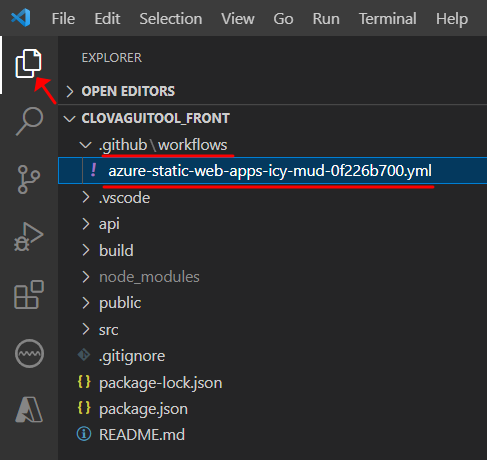

## 1. Azure Static Web App 란?

- 코드 리포지토리(GitHub 또는 Gitlab 등)에서 전체 스택 웹앱을 Azure에 자동으로 빌드하고 배포하는 서비스.
- 리포지터리의 커밋을 푸시하거나 끌어오기가 수락될 때마다 빌드가 자동으로 실행되고 앱과 API가 Azure에 배포됨.
- 웹 프레임워크(React 등)를 사용하여 웹앱을 빌드함.


## 2. 빌드&배포 순서

### 요약

(1) 로컬로 배포할 GiltLab repos 를 클론

(2) Static Web App 만들기

(3) API 만들기

(4) API 호출하도록 프론트 엔드 수정

(5) 로컬에서 프론트 엔드와 API 실행

(6) GitHub Action 워크플로에 API 추가

(7) Commit&Push로 자동 빌드&배포


### 필요한 것

(1) Azure 구독 계정

(2) GitHub 계정 ← 이 계정에 클론한 GitLab repos를 업로드하고 빌드&배포할 거기 때문에 무척 중요


### (1) 로컬로 배포할 GiltLab repos 를 클론

순서 1. GitLab repos에서 Clone with HTTPS로 URL을 복사한다.


순서 2. GitLab repos에 올라간 에셋을 다운로드할 로컬 경로로 이동한다. (예: 내 PC > 바탕 화면 > AzureBuild)


순서 3. 로컬 경로에서 Bash 를 실행한 후, 아래 명령어를 입력하여 다운로드한다. (형식: git clone 복사한 URL)

```bash
git clone https://github.com/<YOUR_GITHUB_ACCOUNT_NAME>/my-first-static-web-app.git
```


### (2) Static Web App 만들기

- Static Web App은 1. Visual Studio Code, 2. Azure portal, 3. Azure CLI 의 3가지 방법이 있는데, 나는 Visual Studio Code의 확장 기능을 사용하였다.
- 이 단계에서는 Visual Studio Code에 Azure와 GitHub에 로그인되어있어야 한다.

순서 1. Visual Studio Code 열고 **파일 > 열기 폴더** 로 편집기에서 클론한 리포지를 연다.


순서 2. **Visual Studio Code > 확장 > 보기 > Azure Static Web Apps 설치**


순서 3. **Azure 확장 창 열기 > F1 키로 명령 팔레트 열기 > Azure Static web Apps: Create Static Web App... 선택**


순서 4. 아래 설정과 값을 입력하여 Static Web App을 생성한다.

| **설정**       | 값                    |
| -------------- | --------------------- |
| Name           | 원하는 앱의 이름 입력 |
| 지역           | East Asia             |
| 빌드 사전 설정 | React                 |
| 코드 위치      | /                     |
| 빌드 위치      | build                 |


순서 5. 생성이 완료되면 내 구독 > Static Web Apps > 생성한 앱 을 확인할 수 있고, 웹앱을 열어볼 수 있다.


### (3) API 만들기

순서 1. Visual Studio Code에서 앱 리포지토리의 루트를 열다. 폴더 구조는 프론트 앱의 원본과 .github/workflows 폴더의 Static Web Apps GitHub 워크 플로가 포함되어있다.




순서 2. **F1 키로 명령 팔레트 열기 > Azure Static Web Apps: Create HTTP Function... 선택** **> 아래 설정값 입력**

| 설정      | 값         |
| --------- | ---------- |
| 언어 선택 | JavaScript |
| 함수 이름 | message    |


순서 3. api > message > index.js > 함수 수정

```javascript
module.exports = async function (context, req) {
    context.res.json({
        text: "Azure API 배포완료-동규"
    });
};
```


### (4) API 호출하도록 프론트 엔드 수정

순서 1. src > App.js 에 API 함수 호출과 확인을 위한 코드를 추가한다.

```javascript
import React, { useState, useEffect } from 'react';

function App() {
  const [data, setData] = useState('');

  useEffect(() => {
    (async function () {
      const { text } = await( await fetch(`/api/message`)).json();
      setData(text);
    })();
  });

  return <div>{data}</div>;
}

export default App;
```


### (5) 로컬에서 프론트 엔드와 API 실행

순서 1. 로컬 경로에서 Bash를 열어 아래 CLI를 설치한다.

```bash
npm install -g @azure/static-web-apps-cli
```


순서 2. CLI 실행 전, 앱을 빌드한다.

```bash
npm install
npm run build
```


순서 3. Static Web Apps CLI로 앱을 시작하여 프론트 엔드 앱과 API를 함께 실행할 수 있다. 로컬 경로에서 실행한 Bash에 앱을 시작한다.

```bash
swa start build --api-location api
```


### (6) GitHub Action 워크플로에 API 추가

순서 1. 워크플로에 API 폴더의 위치를 업데이트 한다. 
***.github/workflows/azure-static-web-apps-DEFAULT-HOSTNAME.yml<>*에서 워크플로 열기 > api_location > api 로 설정 > 저장**


### (7) Commit&Push로 자동 빌드&배포

#### 주의사항1. react 빌드했을 때, 어떠한 warning 도 걸리지 않게 확인한 후에 배포하도록 하자.

#### 주의사항2. 기능에 문제를 일으킬 수 있는 코드 수정은 " // eslint-disable-next-line" 를 이용해서 다음줄 실행을 막을 수 있다.


순서 1. **F1 키로 명령 팔레트 열기 > Git: Commit All > 커밋 메시지 입력**


순서 2. **F1 키로 명령 팔레트 열기 > Git: push**


순서 3. **GitHub repos에서 Action > WorkFlow를 확인할 수 있다.**

