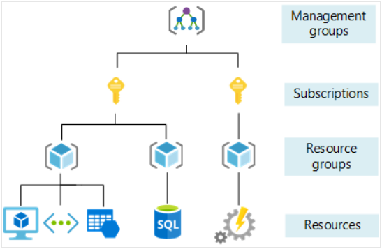
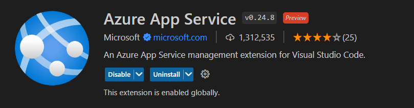
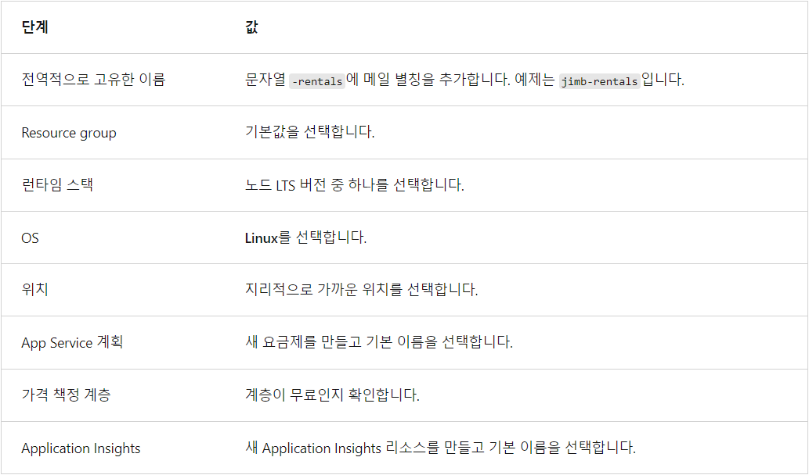
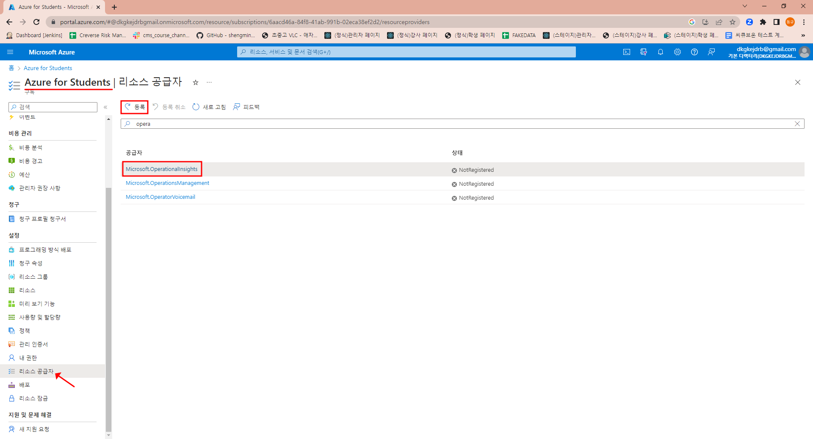
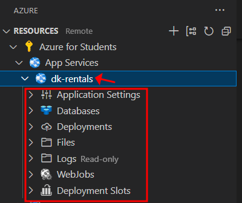
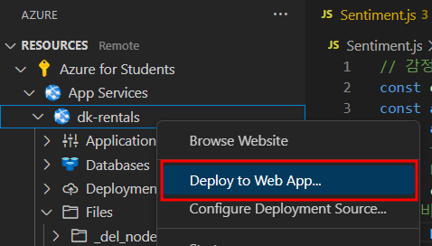
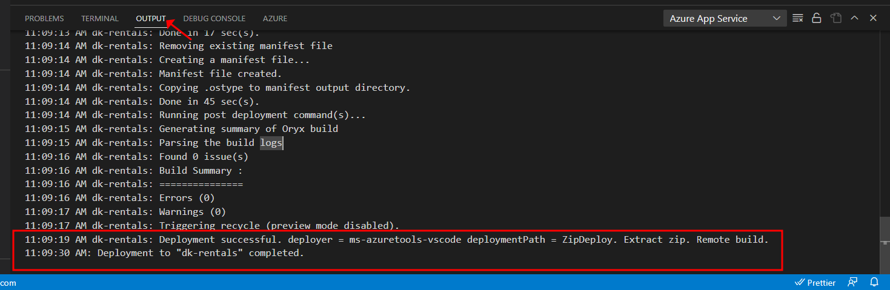
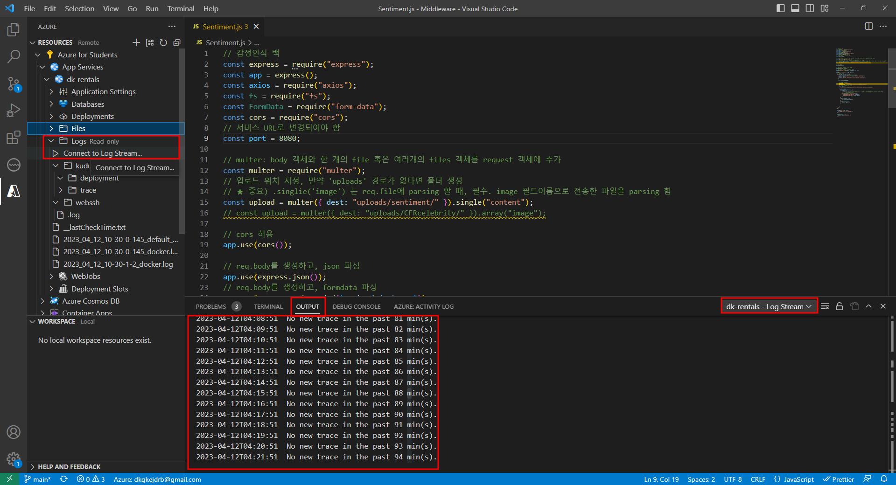
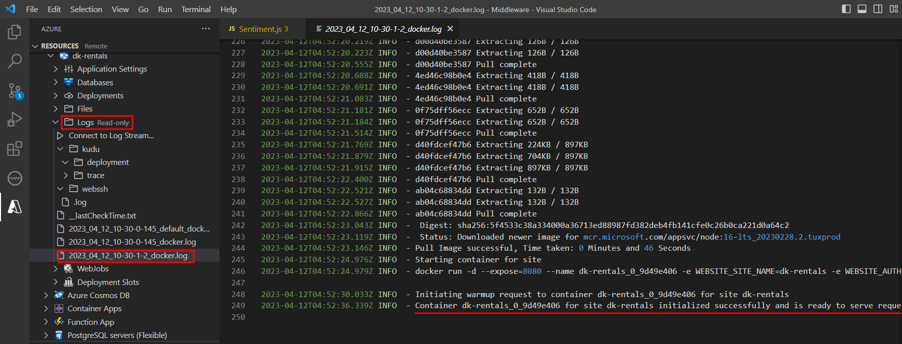
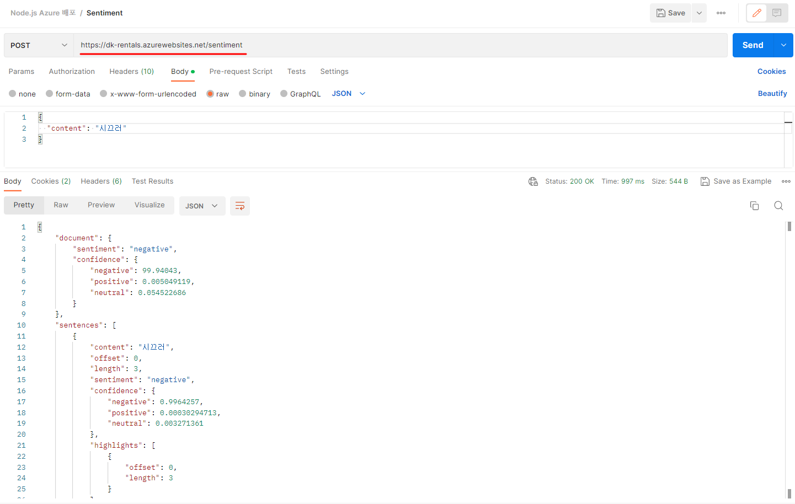

## 1. Azure 리소스를 사용하려면?

Azure를 사용하려면 **관리 그룹 > 구독 > 리소스 그룹 > 리소스** 순으로 구성해야 한다.



- 관리 그룹: Azure 관리를 위한 그룹, 계정을 말함.
- 구독: 구독은 모듈에서 만든 리소스와 계정을 연결.
- 리소스 그룹: Azure 리소스를 관리하는 논리 컨테이너.
- 리소스: Azure App Service와 같이 생성하는 서비스의 인스턴스.


## 2. 리소스 그룹이란?

리소스 그룹을 사용하면 필요에 맞는 논리 단위로 Azure 리소스를 그룹화할 수 있다. 리소스 그룹에 사용하는 명명 전략을 사용하면 리소스를 빠르게 찾고, 해당 용도를 이해하며, 청구 비용을 파악할 수 있다.

- 리소스 그룹 이름의 예: <u>temporary-rental-web-app</u>


리소스 그룹은 5개 도구(1. Visual Studio Code 확장, 2. Azure Portal, 3. Azure CLI, 4. PowerShell, 5. Azure SDK)가 있는데, '1. Visual Studio Code 확장'을 사용하려고 한다.


### 요약

(1) Azure 확장창 설치 & Visual Studio Code에서 구독 찾기

(2) Azure App Service 리소스 만들기

(3) Azure App Service에 Node.js 앱 배포

(4) 로그를 사용하여 오류 찾기


### 필요한 것

(1) Azure 구독 계정

(2) Visual Studio Code 확장도구: Azure App Service


### (1)  Azure 확장창 설치 & Visual Studio Code에서 구독 찾기

이번 포스팅에서는 구체적으로 다루지 않으며, 아래 확장 도구가 Visual Studio Code에 설치되어야 한다.

- Azure App Service




### (2) Azure App Service 리소스 만들기

Azure는 몇 가지 호스팅 옵션(1. Azure App Service, 2. Azure Container, 3. Azure Kubernetes, 4. Azure 컨테이너 앱, 5. Azure Virtual Machines)을 제공하는데, 'Azure App Service'를 사용하겠다.

#### Azure App Service 란?

- Windows 또는 Linux 호스팅 환경을 실행하는 서비스이다. 앱을 구성하고 제어하는 모든 일반 서버 설정을 제어할 수 있다.


순서 1. **Visual Studio 열기 > Azure 창 열기 > 구독 > App Services 마우스 오른쪽 버튼 > 새 웹앱 만들기(고급) 선택**

- 다음 표를 사용하여 만들기 단계에 응답한다.




- The subscription is not registered to use namespace 'Microsoft.OperationalInsights'. .. 오류가 발생했다면, Portal에서 아래와 같이 해당 구독을 등록한다.
- Insights란? App Service 인스턴스의 모니터링 리소스이다.




순서 2. 완료되면 App Services > 새로운 웹앱이 추가된다. 추가된 웹앱을 확장하면 아래와 같은 하위 노드가 구성되고 설명은 아래와 같이 추가된다.



| 하위 노드            | 목적                                                         |
| -------------------- | ------------------------------------------------------------ |
| Application Settings | 이름/값 쌍인 환경 변수.<br />이 노드를 확장하고 Application Insights 키로 저장된 `APPINSIGHTS_INSTRUMENTATIONKEY` 키를 확인합니다. 이 키는 `applicationinsights` npm 패키지로 사용자 지정 로깅을 추가할 때 유용합니다.<br />`SCM_DO_BUILD_DURING_DEPLOYMENT`이(가) 만들어지고 *true*로 설정됩니다. 이 설정을 사용하면 Linux 또는 Node.js 배포에서 npm 종속성을 설치할 수 있습니다. |
| Databases            | 웹앱을 만들면서 동시에 데이터베이스를 만드는 경우 데이터베이스가 여기에 나열됩니다. |
| Deployments          | 배포의 목록을 표시합니다.                                    |
| Files                | 리소스에 배포된 파일입니다. 앱을 배포하기 전에 모든 요청에 대해 hostingstart.html 파일이 반환됩니다. |
| Logs                 | 이 위치는 실행 중인 앱의 로그가 저장되는 위치입니다. 환경 변수 또는 npm 모듈을 실행해야 하지만 올바르게 지정되지 않은 앱을 배포하는 경우 이러한 로그를 보게 될 수 있습니다. 앱이 올바르게 시작되지 않습니다. |
| WebJobs              | Linux 앱에는 WebJobs를 사용할 수 없습니다.                   |
| 배포 슬롯            | -                                                            |


순서 3. Files > hostingstart.html 파일을 열어서 확인. 기본 HTML 파일 검토.


순서 4. Logs 도 확인


### (3) Azure App Service에 Node.js 앱 배포

- 배포할 때, 로컬에 Express.js 앱이 있어야 한다. (GitHub repos 등을 사용하지 않음.)
- Express.js 앱은 [GitHub repos 링크](https://github.com/dkgkejdrb/Middleware)에서 볼 수 있다.
- Express.js 앱의 코드에서 port가 8080으로 향해있는지 확인하고 배포하도록 하자.

```javascript
const port = process.env.PORT || 8080;
```


순서 1. **Visual Studio Code > Azure 확장 창 > 구독 > App Services > 생성한 앱 > 마우스 오른쪽 버튼을 클릭** > **Deploy to Web App...**




순서 2. OUTPUT 콘솔에서 아래와 같은 메시지를 확인했다면, 문제없이 배포된 것이다.




### (4) 로그를 사용하여 오류 찾기

순서 1. **App Services > 생성한 앱 > Logs > Connect to Log Stream...** **> OUTPUT 콘솔창**에서 로그를 확인할 수 있음




순서 2. Logs > _default_docker.log 로 끝나는 파일을 열어 확인할 수 있음.




## 성공화면




## 앞으로 연구해볼 것

1. Azure에서 커스텀 URL 적용해보기
2. 다양한 타입을 받을 수 있는 Express.js 앱 배포하기


## 참고문서

- https://learn.microsoft.com/ko-kr/training/modules/javascript-deploy-expressjs-app-service/exercise-use-resource-group