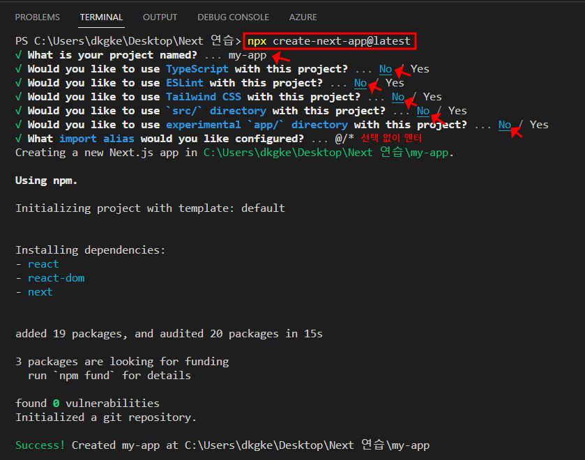
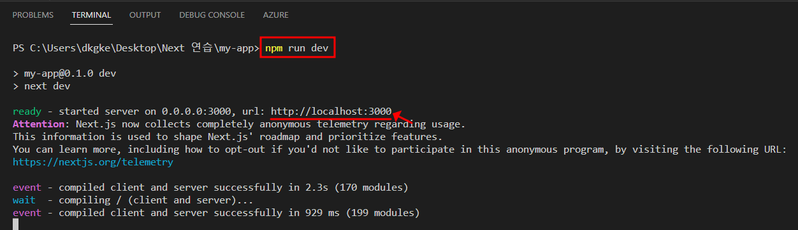
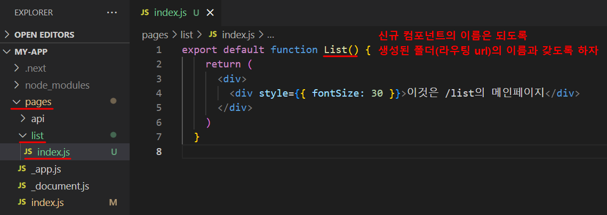
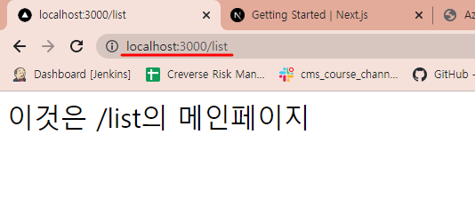
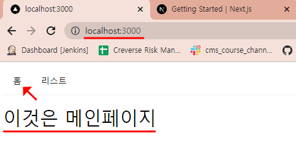
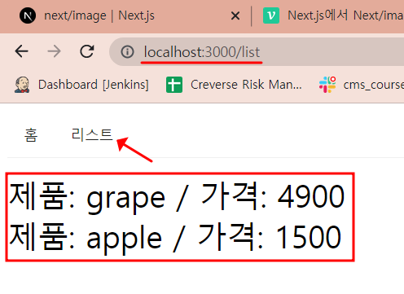
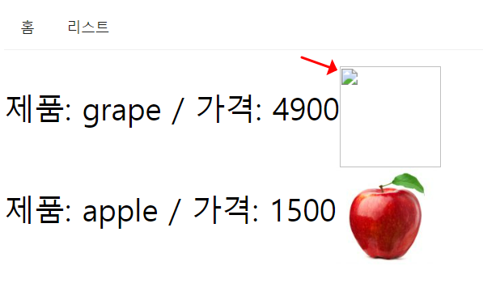

## 1. Next.js 를 사용하는 이유

- 최근에 회사에서 CLOVA AI API를 활용한 통합 학습툴을 개발하고 기능별로 페이지를 나눠주어 외부 채널에서 iframe 으로 쓰게하는 프로젝트를 진행했었다. 그런데, 이렇게 진행하다보니 리액트로 이미 합쳐져있는 페이지를 라우팅하여 찢어주어야 하는 번거로움이 있었고, Express와 웹 배포등의 스터디를 하다보니 풀스택에 대한 욕심이 생겨 Next.js를 스터디하게 되었다.  

- 이유 2. CSR(Client-Side Rendering)의 시대가 가고, SSR(ServerSide Rendering)의 시대가 온다.
  - SSR은 서버에서 html을 내려주는 방식인데, 이를 통해 1. 구글 검색노출, 2. 페이지 로딩속도, 3. 원하는 곳에서 client-side rendering 등의 이점이 생김.

- 이유 3. Next.js는 '풀스택 프레임워크(프론트엔드+백엔드)'이고, 프론트엔드를 리액트 문법으로 작성할 수 있다.


## 2. Next.js 개발 환경 구성

순서 1. 프로젝트 디렉터리 생성 > Visual Studio 실행 > 생성한 프로젝트 폴더 열기

순서 2. Terminal > New Terminal > 아래 생성 명령어 입력 > 프로젝트 셋팅은 아래 참고

```bash
npx create-next-app@latest
```




순서 3. 프로젝트 열기 > Terminal > 실행 명령어 입력 > 실행된 url 열기

```bash
npm run dev
```




순서 4. 아래 파일은 초기화해주도록 하자.

1. index.js 초기화
2. globals.css 초기화
3. Home.module.css 초기화


## 3. Next.js 프로젝트 구조

- .next

- node_modules

- pages

  - api
  - _app.js
  - _document.js **← index.js 를 감싸는 상위 컴포넌트** (주의: antd css 안먹힘)
  - index.js **← 메인 페이지**

- public

- styles

  - globals.css **← 메인 CSS(스타일 모두 적용)**

  ...

- package.json


## 4. 라우팅 (1) - 라우팅 url 생성하기

순서 1. **pages** > **폴더 생성** > **index.js 파일 생성**

※ 주의할 점: 폴더의 이름이 라우팅 url로 사용되니 기억하자.




순서 2. **'URL/폴더이름'으로 라우팅 되었는지 확인**




## 5. 라우팅 (2) - 응용

- 네비게이션 메뉴의 버튼(홈, 리스트)을 클릭하면, 해당 버튼의 URL( / , /list )로 이동하도록 아래와 같이 코드를 작성했다. component는 antd를 활용하였다.

**[ pages > index.js ]**

```react
import { Menu } from "antd";

const items = [
  {
    label: (
      <a href="/">홈</a>  // pages > index.js 페이지로 이동
    ),
    key: 'home',
  },
  {
    label: (
      <a href="/list">리스트</a>  // pages > list > index.js 페이지로 이동
    ),
    key: 'list',
  },
]

export default function List() {
  return (
    <div>
      <Menu items={items} style={{ marginBottom: 16 }} mode="horizontal" />
      <div style={{ fontSize: 30 }}>이것은 /list의 메인페이지</div>
    </div>
  )
}
  
```




**[ pages > list > index.js ]**

```react
import { Menu } from "antd";

const items = [
	... 생략
]

const productArray = [
  { name: "grape", price: 4900 },
  { name: "apple", price: 1500 }
]

export default function List() {
  return (
    <div>
      <Menu items={items} style={{ marginBottom: 16 }} mode="horizontal" />
      {
        productArray.map((product) => { 
          return(
            <div style={{ fontSize: 30 }}>
              {`제품: ${product.name} / 가격: ${product.price}`}
            </div>
          );
        })
      }
    </div>
  )
}
```




## 6. 이미지  (1) - 정적 import

순서 1. Next.js는 이미지를 최적화해주는 컴포넌트(Image)를 제공하는데, 아래와 같이 임포트할 수 있다.

```react
import Image from "next/image"
```


순서 2. Image 컴포넌트를 사용하는 방식은 2가지(1. 정적 import, 2. 외부 url)가 있는데, 먼저 정적으로 이미지를 임포트하는 방식은 아래와 같다.

```react
// public 경로에 이미지 넣기 > 경로는 "/public/이미지"
import grape from "/public/grape_img.png"
```


순서 3. Image 컴포넌트를 사용하기 위해서 필수적인 4개의 Props가 있다. Image 컴포넌트 사용시 반드시 추가하도록 하자.

- src
- alt
- width
- height

```react
<Image src={product.url} alt="" width={100} height={100} />
```


## 7. 이미지  (2) - 외부 url

순서 1. 서버로부터 이미지를 불러와 쓰는 경우 외부 url을 src경로에 넣어야할 때가 있다. 이 때는 아래와 같이 직접 url 주소를 입력하여 사용할 수 있다.

```react
import Image from "next/image"

// 서버에서 받아온 리스트라 가정
const productArray = [
  {
    name: "apple",
    price: 1500,
    // 외부 url
    url: "https://subzfresh.com/wp-content/uploads/2022/04/apple_158989157-150x150.jpg"
  },
]

export default function List() {
  return (
      <Image src={product.url} alt="" width={100} height={100} />
  )
}
```


순서 2. 하지만, 위와 같이 Image 컴포넌트를 사용하면 에러(Error: Invalid src props ... )가 발생하는데, 이럴 때는 아래와 같이 '최적화옵션'을 꺼주면 된다.

```react
// 외부 url 사용 시, unoptimized={true} 추가
<Image src={product.url} alt="" width={100} height={100} unoptimized={true} />
```


## 8. 이미지  (3) - antd의 Image 컴포넌트 사용해보기

- antd의 Image 컴포넌트로 대체하여 사용했는데, 정적 import 방식이 아래와 같이 임포트하지 못하는 문제가 있었다.



- 콘솔에서는 아래와 같은 오류메시지가 확인되었는데, 검색해보니 next.config.js 에서 셋팅을 추가해주면 해결될 것도 같다. 

```text
GET http://localhost:3000/[object%20Object] 404 (Not Found)
```


## 앞으로 연구해볼 것

1. Next.js에서 MongoDB 사용하여 게시판만들기


## 참고문서

- 애플코딩 - Next.js로 웹서비스 만들기