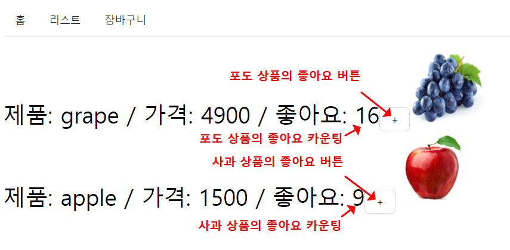

## 1. JSX props

- props란? 컴포넌트의 속성으로 사용되는 데이터이다. props의 타입은 객체와 비슷하다.

#### [문제 상황]

- 프로젝트를 하면서, props를 잘 사용하지 않아 HTML 코드가 많아지고 가독성이 떨어지는 문제가 있었다.

```react
// 1. 서버에서 받아온 장바구니 리스트라 가정
const CartItemsArray = [
    { userId: "A", product: "사과", price: 1500, numbers: 3 },
    { userId: "B", product: "포도", price: 4900, numbers: 1 },
    ... (생략)
]

export default function Cart() {
    return(
        <>
        	// 2. 공통 컴포넌트를 정의하여 코드의 가독성을 높일 필요가 있음
        	// 첫번째 장바구니 리스트
            <div className="cart-item">
                <p>{CartItemsArray[0].userId}</p>
                <p>{CartItemsArray[0].product}</p>
                <p>{CartItemsArray[0].price}</p>
                <p>{CartItemsArray[0].numbers}</p>
            </div>
            // 두번째 장바구니 리스트
            <div className="cart-item">
                <p>{CartItemsArray[1].userId}</p>
                <p>{CartItemsArray[1].product}</p>
                <p>{CartItemsArray[1].price}</p>
                <p>{CartItemsArray[1].numbers}</p>
            </div>
        	... (생략)
    	</>
    );
}
```


#### [해결]

- 아래와 같이 호출될 공통 컴포넌트를 정의한다.
- 나중에 공통 컴포넌트를 호출할 때, "props.키"를 통해 전달된 props에 접근할 수 있다.

```react
const CartItemsArray = ...(생략)

// 1. 공통 컴포넌트 선언
// props 주목
const CartItem = (props) => {
    return (
        <div className="cart-item">
            <p>{props.userId}</p>
            <p>{props.product}</p>
            <p>{props.price}</p>
            <p>{props.numbers}</p>
        </div>
    );
}

// 2. 공통 컴포넌트 호출
export default function Cart() {
  return (
    <div>
        {
            CartItemsArray.map((cartItem) => {
                return (
                    <CartItem key={uuid()} 
                        // 아래 속성값들은 props 객체의 key로 전달.
                        userID={cartItem.userId} product={cartItem.product} price={cartItem.price} numbers={cartItem.numbers} />
                );                
            })
        }
    </div>
  )
}
```


## 2. 배열 state

- 개발을 하다보면, 동일한 기능을 가진 state를 각각 따로 관리해야할 때가 있다. 
- '나열된 상품의 좋아요 기능'을 예로 들어보자. 아래와 같이 상품(포도, 사과)의 경우, 좋아요 버튼의 state는 동일한 기능이지만 따로 관리되어야 한다.




#### [문제 상황]

- 상품별로 state를 따로 관리하기 위해 아래와 같이 코드를 작성하면, 두가지 문제가 발생한다.
  - 문제 1. 상품 정보를 서버로부터 받고 계속 변경된다고 했을 때, 변경된 정보를 반영할 수가 없다.
  - 문제 2. 상품이 추가될때마다 상태값도 추가되기 때문에 코드가 길어져 가독성이 떨어진다.

```react
export default function List() {
  // 포도 좋아요 상태값
  const [like0, setLike0] = useState(0);
  // 사과 좋아요 상태값
  const [like1, setLike1] = useState(0);

  return (
	<div>
		<Button onClick={()=>{ setLike0(like0 + 1) } 
         <Button onClick={()=>{ setLike1(like1 + 1) }
	</div>
  );
}
```


#### [해결]

- 순서 1. 모든 상품의 좋아요를 관리할 state를 배열로 선언한다.

```react
// likeArray[0] ← 포도 좋아요 state
// likeArray[1] ← 사과 좋아요 state
const [likeArray, setLikeArray] = useState([0, 0]);
```


- 순서 2. 서버로부터 받아온 상품 리스트 정보를 map으로 조회하고, map 실행문에 Button 의 id 값을 index 값으로 지정하여 반복한다.

```react
// 1. 서버에서 받아온 장바구니 리스트라 가정
const productArray = [
    { name: "포도", price: 4900 },
    { name: "사과", price: 1500 },
]

export default function List() {
  <>
    // 2. 상품 리스트 정보를 map으로 조회
    productArray.map((product, index) => { 
      <Button
        id={index}>
      </Button>
    }
  </>
}
```


- 순서 3. Button 의 onClick 실행 함수 코드를 아래와 같이 작성한다.

```react
export default function List() {
  <>
    productArray.map((product, index) => { 
      <Button
        id={index}
        // onClick 실행 함수 코드.
        // 버튼을 클릭했을 때, 버튼의 id값으로 상품을 식별.
        onClick={(e)=>{
          let newArray = [...likeArray];
          newArray[e.target.id] = likeArray[e.target.id] + 1;
          setLikeArray(newArray);
          >
      </Button>
    }
  </>
}
```

