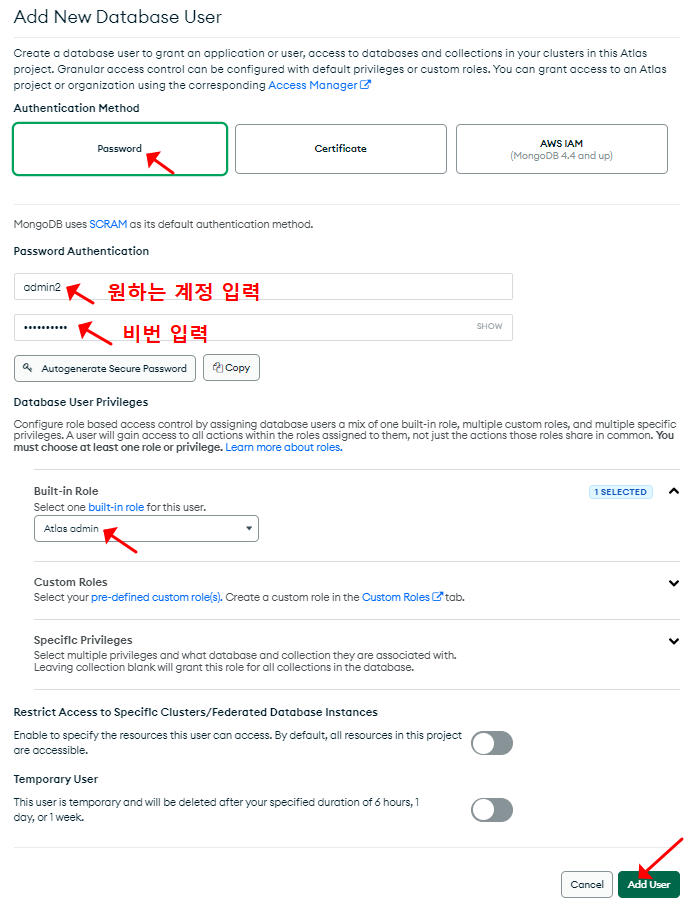
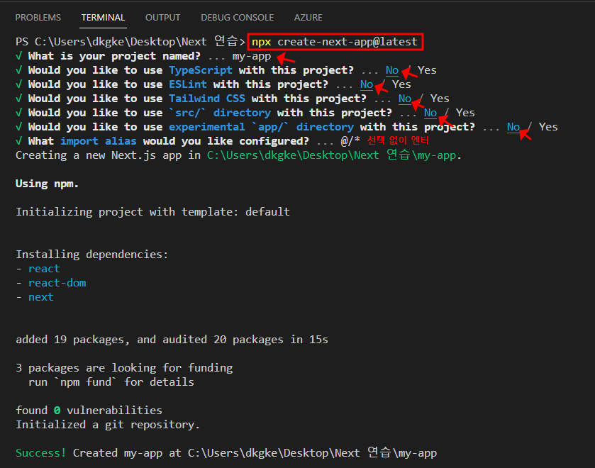
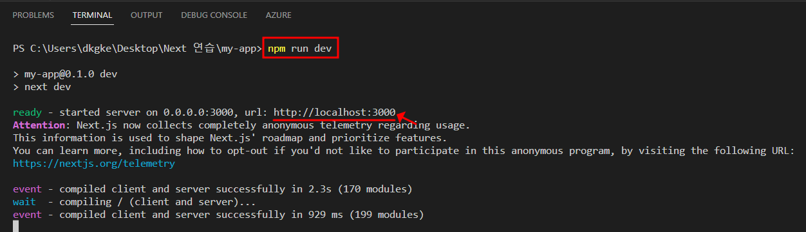
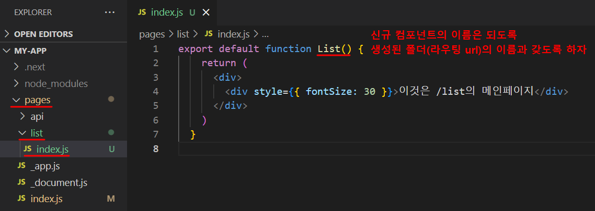
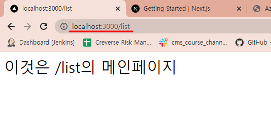

## 1. MongoDB  

- MongoDB 란? 비관계형 DB. 관계형 DB는 엑셀과 같이 column 마다 label을 갖지만, 비관계형 DB는 json 형식처럼 배열로 쌓을 수 있음. 초심자가 익히기에 좋으며, 대용량 분산처리도 잘해줌.
- MongoDB의 데이터 저장 방식은 collection을 하나 만들어서 그 안에 document를 만들어서 데이터를 기록하는 식으로 데이터들을 저장한다. 비유하자면 collection은 폴더, document는 파일이라고 생각하자. document에 데이터를 기록할 때는 자바스크립트 object 자료형과 똑같이 저장하면 된다.


## 2. 가입, 셋팅, 배포하기

순서 1. https://www.mongodb.com/ 방문 → 회원가입하기

순서 2. FREE & 서버 선택


순서 3. DataBase Access → '+ ADD NEW DATABASE USER' 클릭 > 아래와 같이 DB의 읽기, 쓰기, 수정등을 할 수 있는 관리자 계정을 생성




순서 4. Network Access → 'Add IP Address' 클릭 → 'ADD CURRENT IP ADDRESS' 와 'ALLOW ACCESS FROM ANYWHERE' 선택하여 DB 접속 IP를 여유롭게 설정

-  실제 서비스할 때는 IP를 추가하여 보안을 걸어두는게 좋을 것 같다.


## 3. Database,  Collection, Document 생성하기

MogoDB의 Database > Collection > Docuemnt는 아래와 계층구조이다. Document는 JSON의 형태로 저장하고, 데이터를 저장하는 파일이다. 그리고 Docuemnt는 필요에따라 생성되어 Collection에 여러개 저장된다.


 


순서 1. Database → Browse Collections 선택


순서 2. Collections → '+ Create Database' 클릭 → Database name 과 Collection name 입력하기 → Create 클릭


순서 3. 'INSERT DOCUMENT' 클릭 → key:value 형태로 저장 → Insert 클릭


## 4. Database,  Collection, Document 생성하기


## 1. Next.js 를 사용하는 이유

- 이유 1. CSR(Client-Side Rendering)의 시대가 가고, SSR(ServerSide Rendering)의 시대가 온다.
  - SSR은 서버에서 html을 내려주는 방식인데, 이를 통해 1. 구글 검색노출, 2. 페이지 로딩속도, 3. 원하는 곳에서 client-side rendering 등의 이점이 생김.

- 이유 2. Next.js는 '풀스택 프레임워크(프론트엔드+백엔드)'이고, 프론트엔드를 리액트 문법으로 작성할 수 있다.


## 2. Next.js 개발 환경 구성

순서 1. 프로젝트 디렉터리 생성 > Visual Studio 실행 > 생성한 프로젝트 폴더 열기

순서 2. Terminal > New Terminal > 아래 생성 명령어 입력 > 프로젝트 셋팅은 아래 참고

```bash
npx create-next-app@latest
```




순서 3. 프로젝트 열기 > Terminal > 실행 명령어 입력 > 실행된 url 열기

```bash
npm run dev
```




순서 4. 아래 파일은 초기화해주도록 하자.

1. index.js 초기화
2. globals.css 초기화
3. Home.module.css 초기화


## 3. Next.js 프로젝트 구조

- .next

- node_modules

- pages

  - api
  - _app.js
  - _document.js **← index.js 를 감싸는 상위 컴포넌트** (주의: antd css 안먹힘)
  - index.js **← 메인 페이지**

- public

- styles

  - globals.css **← 메인 CSS(스타일 모두 적용)**

  ...

- package.json


## 4. 라우팅 (1) - 라우팅 url 생성하기

순서 1. **pages** > **폴더 생성** > **index.js 파일 생성**

※ 주의할 점: 폴더의 이름이 라우팅 url로 사용되니 기억하자.




순서 2. **'URL/폴더이름'으로 라우팅 되었는지 확인**




## 5. 라우팅 (2) - 응용

- 네비게이션 메뉴의 버튼(홈, 리스트)을 클릭하면, 해당 버튼의 URL( / , /list )로 이동하도록 아래와 같이 코드를 작성했다. component는 antd를 활용하였다.

**[ pages > index.js ]**

```react
import { Menu } from "antd";

const items = [
  {
    label: (
      <a href="/">홈</a>  // pages > index.js 페이지로 이동
    ),
    key: 'home',
  },
  {
    label: (
      <a href="/list">리스트</a>  // pages > list > index.js 페이지로 이동
    ),
    key: 'list',
  },
]

export default function List() {
  return (
    <div>
      <Menu items={items} style={{ marginBottom: 16 }} mode="horizontal" />
      <div style={{ fontSize: 30 }}>이것은 /list의 메인페이지</div>
    </div>
  )
}
  
```


**[ pages > list > index.js ]**

```react
import { Menu } from "antd";

const items = [
	... 생략
]

const productArray = [
  { name: "grape", price: 4900 },
  { name: "apple", price: 1500 }
]

export default function List() {
  return (
    <div>
      <Menu items={items} style={{ marginBottom: 16 }} mode="horizontal" />
      {
        productArray.map((product) => { 
          return(
            <div style={{ fontSize: 30 }}>
              {`제품: ${product.name} / 가격: ${product.price}`}
            </div>
          );
        })
      }
    </div>
  )
}
```


## 6. 이미지  (1) - 정적 import

순서 1. Next.js는 이미지를 최적화해주는 컴포넌트(Image)를 제공하는데, 아래와 같이 임포트할 수 있다.

```react
import Image from "next/image"
```


순서 2. Image 컴포넌트를 사용하는 방식은 2가지(1. 정적 import, 2. 외부 url)가 있는데, 먼저 정적으로 이미지를 임포트하는 방식은 아래와 같다.

```react
// public 경로에 이미지 넣기 > 경로는 "/public/이미지"
import grape from "/public/grape_img.png"
```


순서 3. Image 컴포넌트를 사용하기 위해서 필수적인 4개의 Props가 있다. Image 컴포넌트 사용시 반드시 추가하도록 하자.

- src
- alt
- width
- height

```react
<Image src={product.url} alt="" width={100} height={100} />
```


## 7. 이미지  (2) - 외부 url

순서 1. 서버로부터 이미지를 불러와 쓰는 경우 외부 url을 src경로에 넣어야할 때가 있다. 이 때는 아래와 같이 직접 url 주소를 입력하여 사용할 수 있다.

```react
import Image from "next/image"

// 서버에서 받아온 리스트라 가정
const productArray = [
  {
    name: "apple",
    price: 1500,
    // 외부 url
    url: "https://subzfresh.com/wp-content/uploads/2022/04/apple_158989157-150x150.jpg"
  },
]

export default function List() {
  return (
      <Image src={product.url} alt="" width={100} height={100} />
  )
}
```


순서 2. 하지만, 위와 같이 Image 컴포넌트를 사용하면 에러(Error: Invalid src props ... )가 발생하는데, 이럴 때는 아래와 같이 '최적화옵션'을 꺼주면 된다.

```react
// 외부 url 사용 시, unoptimized={true} 추가
<Image src={product.url} alt="" width={100} height={100} unoptimized={true} />
```


## 8. 이미지  (3) - antd의 Image 컴포넌트 사용해보기

- antd의 Image 컴포넌트로 대체하여 사용했는데, 정적 import 방식이 아래와 같이 임포트하지 못하는 문제가 있었다.


- 콘솔에서는 아래와 같은 오류메시지가 확인되었는데, 검색해보니 next.config.js 에서 셋팅을 추가해주면 해결될 것도 같다. 

```text
GET http://localhost:3000/[object%20Object] 404 (Not Found)
```


## 앞으로 연구해볼 것

1. Next.js에서 MongoDB 사용하여 게시판만들기


## 참고문서

- https://learn.microsoft.com/ko-kr/training/modules/javascript-deploy-expressjs-app-service/exercise-use-resource-group