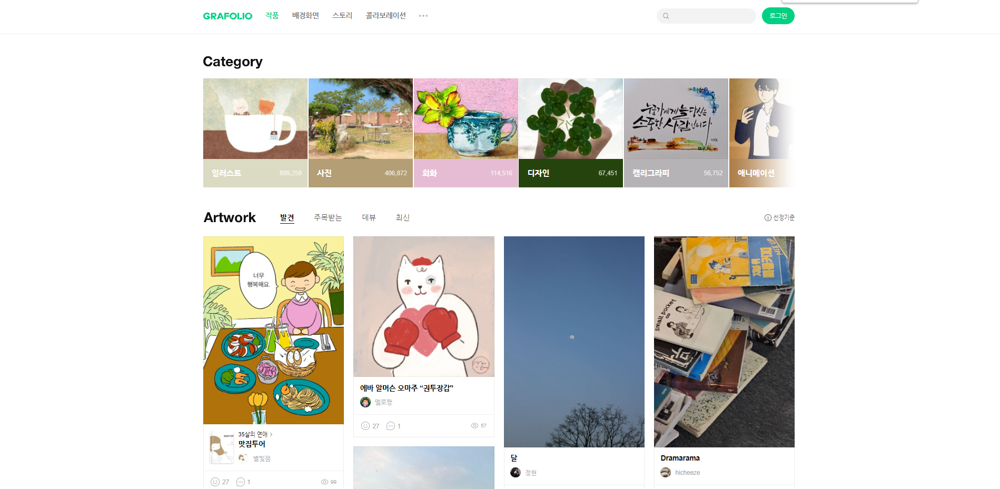

## 1. MongoDB  

- MongoDB 란? 비관계형 DB. 관계형 DB는 엑셀과 같이 column 마다 label을 갖지만, 비관계형 DB는 json 형식처럼 배열로 쌓을 수 있음. 초심자가 익히기에 좋으며, 대용량 분산처리도 잘해줌.
- MongoDB의 데이터 저장 방식은 collection을 하나 만들어서 그 안에 document를 만들어서 데이터를 기록하는 식으로 데이터들을 저장한다. 비유하자면 collection은 폴더, document는 파일이라고 생각하자. document에 데이터를 기록할 때는 자바스크립트 object 자료형과 똑같이 저장하면 된다.


## 2. 가입, 셋팅, 배포하기

순서 1. https://www.mongodb.com/ 방문 → 회원가입하기

순서 2. FREE & 서버 선택


순서 3. DataBase Access → '+ ADD NEW DATABASE USER' 클릭 > 아래와 같이 DB의 읽기, 쓰기, 수정등을 할 수 있는 관리자 계정을 생성


순서 4. Network Access → 'Add IP Address' 클릭 → 'ADD CURRENT IP ADDRESS' 와 'ALLOW ACCESS FROM ANYWHERE' 선택하여 DB 접속 IP를 여유롭게 설정

-  실제 서비스할 때는 IP를 추가하여 보안을 걸어두는게 좋을 것 같다.


## 3. Database,  Collection, Document 생성하기

MogoDB의 Database > Collection > Docuemnt는 아래와 계층구조이다. Document는 JSON의 형태로 저장하고, 데이터를 저장하는 파일이다. 그리고 Docuemnt는 필요에따라 생성되어 Collection에 여러개 저장된다.


 


순서 1. Database → Browse Collections 선택


순서 2. Collections → '+ Create Database' 클릭 → Database name 과 Collection name 입력하기 → Create 클릭


순서 3. 'INSERT DOCUMENT' 클릭 → key:value 형태로 저장 → Insert 클릭


## 4. Next.js 에서 MongoDB 연결하기

순서 1. Database → Connect → Node.js 드라이버 선택


순서 2. Add your connection string into your application code 의 코드 복사


순서 3. 프로젝트 폴더에서 mongodb 라이브러리를 설치한다.

```bash
npm install mongodb
```


순서 4. 앞서 셋팅한 DB를 입출력할 수 있는 변수(connectDB)를 export 할 용도의 스크립트를 원하는 경로에 작업한다.


※주의사항: connect 스크립트는 프론트 코드에 작성하면, 훅에 의해 반복적으로 연결될 수 있어서 리스키 함. 그래서, 프론트 코드와 분리함.

**[ root > util > index.js ]**

```react
import { MongoClient } from 'mongodb'
const url = 'mongodb+srv://<아이디입력>:<비번입력>@cluster0.vbpuhau.mongodb.net/?retryWrites=true&w=majority'
// 위 url로 연결할 때 아래 옵션을 true로 설정해야 함
const options = { useNewUrlParser: true }
let connectDB

if (process.env.NODE_ENV === 'development') {
  if (!global._mongo) {
    global._mongo = new MongoClient(url, options).connect()
  }
  connectDB = global._mongo
} else {
  connectDB = new MongoClient(url, options).connect()
}
// connectDB를 통해 DB에 입출력할 수 있음
export { connectDB }
```


순서 5. connectDB를 통해 입출력한 값을 렌더링할 프론트 페이지(pages > index.js)를 아래와 같이 수정한다.

**[ root > pages > index.js - 에러가 발생하는 코드]**

```react
import { connectDB } from "@/util/index.js"

export default async function Home() {
  let client = await connectDB;
  db = client.db('forum');
  let result = await db.collection('post').find().toArray();

  return (
    <main>
      {result[0].title}
    </main>
  )
}
```


그런데, dns와 같은 Node.js 서버쪽 모듈을 사용하지 않았는데, 아래와 같은 오류가 발생한다.


문제지점은 connectDB가 있는 스크립트에서 MongoClient 를 임포트하는게 원인이었는데, 프론트에서 서버쪽 node 모듈(dns)를 사용하기 때문에 문제였다. 이 문제를 해결하기 위해서는 getServerSideProps()에 쿼리를 작성하고 응답 결과를 props로 리턴한 후, 전달받은 props를 렌더하면 된다.

**[ root > pages > index.js - 수정된 코드]**

```react
import { connectDB } from "@/util/index"

// getServerSideProps: 프론트에서 서버쪽 모듈을 사용할 수 있음
export async function getServerSideProps() {
  let client = await connectDB;
  let db = client.db('forum');
  let result = await db.collection('post').find().toArray();
  // JSON 형태로 props 키로 응답결과 전달
  // return {
  //    props: {
  //        key1: value1
  //        key2: vlaue2
  //        ...
  //    }
  // }
  return {
    props: {
      result: JSON.parse(JSON.stringify(result)) // DB를 JSON으로 파싱
    }
  }
}

export default function Home(result) {
  // {_id: '6440b24661fb1d0e917aa649', title: '제목 1', content: '내용 1'}
  console.log(result.result[0])
  return (
    <>
      { result.result[0].title }
    </>
  )
}
```


## 5. 게시판 만들기 계획

작가의 개인 작품 블로그를 통한 작품 홍보, 작가와의 Contact 포인트가 목적이며, 회원가입과 작품구매는 2차 개발에서 반영할 생각이다.

그라폴리오 화면을 참고하여, 아래와 같이 큰틀을 잡아봤다.

**클라이언트 앱**

- 어드민 로그인
  - DB에 어드민 계정 등록 > 로그인 버튼 클릭 시, 어드민 조회 > 로그인 성공하면, 어드민 대시보드로 이동
- 대시보드
  - 작성한 글의 리스트 항목
  - 작성한 글 보기, 수정하기
  - 새로운 글 작성하기


**관리자 앱**

- 상단 메뉴
  - 홈 버튼
  - 작품 버튼
  - 작가 연락처
  - 로그인 (2차 개발에서 회원가입과 함께 제공)
- 중단
  - Category
  - Artwork
- 하단
  - 로고





## 앞으로 연구해볼 것

1. 글 업로드를 위한, 관리자 웹 배포
1. 관리자 웹에서 화면 새로고침 시, 로그인 유지 방법
