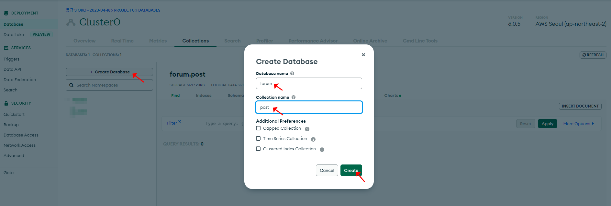
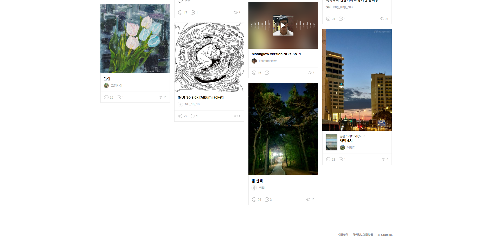

## 1. 리덕스 사용하기

아래는 Next에서 리덕스를 사용할때 참고할 유용한 블로그이다.

Next에서 리덕스를 셋팅하는 방법은 다음에 자세히 다뤄봐야할 것 같다.

([링크](https://devkkiri.com/post/59cb38dd-f939-462d-9e7f-afcc338b621f)) Next 에서 리덕스 사용하기 


## 2. 라우팅하기

라우팅을 위해서는 pages 경로에 원하는 폴더를 생성하고, 생성한 폴더에 index.js 파일을 생성하여 렌더링할 수 있다.

다음으로 아래와 같이 router object와 push 메서드를 사용하여, 생성한 폴더를 이름으로하는 url로 이동시킬 수 있다.

```react
import { useRouter } from 'next/router';

export default function Page() {
  const router = useRouter();
  return (
    <button type="button" onClick={() => router.push('/dashboard')}>
      Click me
    </button>
  )
}
```


## 3. Next.js 로그인 유지방법

NextJS의 문서에는 2가지의 autehntication patterns 가 제공된다.

1. server side 에서는 loading skeleton을 제공하고, client side 에서 로그인 처리
2. server side 에서 로그인을 처리하고 그 정보를 client side로 넘기기


나는 여기서 위 두번째 방식을 사용할 거고, 흐름은 대략적으로 아래와 같다.

- **순서1.** 관리자 로그인 페이지에서 로그인정보를 axios로 서버에 던짐 
- **순서2.** 로그인 서버에서 체크했을 때, 로그인 정보가 일치하면, 성공(상태값, 메시지) 응답. 그리고 관리자가 로그인했다는 뜻의 값(session: true)로 DB 수정
- **순서3.** 로그아웃하면, 로그아웃했다는 뜻의 값(session: false)으로 DB 수정

※ 그리고 관리자 페이지에서 초기 훅에는 위 session 이 true 한지 검사. 새로 고침을 해도 session 의 값은 DB에 저장되어있기 때문에 계속 유지됨.


**[ 로그인 서버 ]**

```react
// pages > api > post > logIn.js
import { connectDB } from "@/util/index";

export default async function handler(req, res) {
    // axios로 전송된 req.body
    const body = req.body;
    if (req.method == 'POST') {
        // 요청한 id와 pw가 관리자 계정인지 체크
        if(body.id === "admin" && body.pw === "123456") {
            // mongoDB 데이터베이스(forum) 연결
            let db = (await connectDB).db('forum');

            // forum > account 콜렉션에서 id가 "admin"인 도큐먼트를 찾아, session을 "true"로 변경
            db.collection('account').updateOne(
            {
                id: "admin"
            },
            {
                "$set":
                {
                    session: "true"
                }
            })
            // id와 pw가 일치한 경우의 성공 메시지
            res.send({ status: 200, msg: "로그인 성공" })
        } else {
            // id와 pw가 일치하지 않은 경우의 메시지
            res.send({ status: 401, msg: "아이디, 비밀번호를 확인해주세요." })
        }
    }
}
```


**[ 관리자 로그인 페이지 - 클라이언트 ]**

```react
// pages > index.js
import { connectDB } from "@/util/index"
import { Input, Button } from "antd";
import { useState } from "react";
import { useRouter } from "next/router";
import axios from "axios";

// getServerSideProps로 DB에 컨넥트
export async function getServerSideProps() {
  let client = await connectDB;
  let db = client.db('forum');
  let result = await db.collection('account').find().toArray();
  return {
    props: {
      result: JSON.parse(JSON.stringify(result))
    }
  }
}

export default function Home(result) {
  // 라우터 객체
  const router = useRouter();
  // 인풋 상태값
  const [id, setId] = useState(null);
  const [pw, setPw] = useState(null);;

  // 관리자 로그인 체크
  const authHandler = () => {
    // 로그인 API로 id와 pw를 json으로 전송
    // 호출 주소에 주목
    axios.post("/api/post/logIn", {
        "id": id,
        "pw": pw
    }, {
      "Content-Type": "application/json"
    }).then(res => {
      let status = res.data.status;
      // 응답결과가 200이면, 대시보드로 이동
      if (status === 200) {
        router.push("/dashboard");
      } 
      // 응답결과가 401이면, 서버의 msg값을 경고로 출력
      else {
        window.alert(res.data.msg);
      }
    }).catch(err => {
      console.log(err)
    })
  }

  return (
    <>
    {
      // dashboard url 사용하기
      <main style={{ width: "100%", height: "100vh", display: "flex", justifyContent: "center", alignItems: "center" }}>
        <div style={{ width: 390, height: 450, display: "flex", flexDirection: "column", justifyContent: "center" }}>
          <span style={{ width: 390, height: 40, fontSize: 24, fontWeight: 600, textAlign: "center"}}>관리자 로그인</span>
          <Input onChange={(e)=>{setId(e.target.value)}} placeholder="아이디를 입력하세요." style={{ marginTop: 16, width: 390, height: 55 }} />
          <Input onChange={(e)=>{setPw(e.target.value)}} placeholder="비밀번호를 입력하세요." style={{ marginTop: 8, width: 390, height: 55 }} />
          <Button onClick={()=>{authHandler()}} type="primary" style={{ marginTop: 16, width: 390, height: 55 }}>로그인</Button>
        </div>
      </main>
    }
    </>
  )
}
```


**[ 로그아웃 서버 ]**

```react

// pages > api > post > logOut.js
import { connectDB } from "@/util/index";

export default async function handler(req, res) {
    
    if (req.method == 'GET') {
        // forum > account 콜렉션에서 id가 "admin"인 도큐먼트를 찾아, session을 "false"로 변경
        let db = (await connectDB).db('forum')
        db.collection('account').updateOne(
        {
            id: "admin"
        },
        {
            "$set":
            {
                session: "false"
            }
        })

        res.send({ status: 200, msg: "로그아웃 성공" })
    }
}
```


**[ 관리자 대시보드 페이지 - 클라이언트 ]**

```react
// pages > dashboard > index.js
import { connectDB } from "@/util/index"
import { Button } from "antd";
import { useEffect } from "react";
import { useRouter } from "next/router";
import axios from "axios";

export async function getServerSideProps() {
    let client = await connectDB;
    let db = client.db('forum');
    let result = await db.collection('account').find().toArray();
    return {
        props: {
            result: JSON.parse(JSON.stringify(result))
        }
    }
}

export default function Dashboard(result) {
    const router = useRouter();

    const _session = result.result[0].session;

    // 로그아웃 체크
    const authHandler = () => {
    // 로그아웃 API 호출
    axios.get("/api/post/logOut")
    .then(res => {
      let status = res.data.status;
      // 응답결과가 200이면, 홈으로 이동
      if (status === 200) {
        router.push("/home");
      } 
      else {
        window.alert(res.data.msg);
      }
    }).catch(err => {
      console.log(err)
    })
  }

    useEffect(() => {
        // /dashboard 첫 진입시 관리자 로그인 유무 체크
        // 만약 로그인되어있지 않으면 로그인 페이지로 이동
        if(_session === "false") {
            window.alert("세션이 만료되어 관리자페이지로 이동합니다.")
            router.push("/home")
        }
    }, [])

    return (
        <>            
            <Button onClick={()=>{authHandler()}} type="primary" style={{ marginTop: 16, width: 390, height: 55 }}>로그아웃</Button>
        </>
    );
}

```


## 2. 가입, 셋팅, 배포하기

순서 1. https://www.mongodb.com/ 방문 → 회원가입하기

순서 2. FREE & 서버 선택


순서 3. DataBase Access → '+ ADD NEW DATABASE USER' 클릭 > 아래와 같이 DB의 읽기, 쓰기, 수정등을 할 수 있는 관리자 계정을 생성


순서 4. Network Access → 'Add IP Address' 클릭 → 'ADD CURRENT IP ADDRESS' 와 'ALLOW ACCESS FROM ANYWHERE' 선택하여 DB 접속 IP를 여유롭게 설정

-  실제 서비스할 때는 IP를 추가하여 보안을 걸어두는게 좋을 것 같다.


## 3. Database,  Collection, Document 생성하기

MogoDB의 Database > Collection > Docuemnt는 아래와 계층구조이다. Document는 JSON의 형태로 저장하고, 데이터를 저장하는 파일이다. 그리고 Docuemnt는 필요에따라 생성되어 Collection에 여러개 저장된다.


 


순서 1. Database → Browse Collections 선택


순서 2. Collections → '+ Create Database' 클릭 → Database name 과 Collection name 입력하기 → Create 클릭




순서 3. 'INSERT DOCUMENT' 클릭 → key:value 형태로 저장 → Insert 클릭


## 4. Next.js 에서 MongoDB 연결하기

순서 1. Database → Connect → Node.js 드라이버 선택


순서 2. Add your connection string into your application code 의 코드 복사


순서 3. 프로젝트 폴더에서 mongodb 라이브러리를 설치한다.

```bash
npm install mongodb
```


순서 4. 앞서 셋팅한 DB를 입출력할 수 있는 변수(connectDB)를 export 할 용도의 스크립트를 원하는 경로에 작업한다.


※주의사항: connect 스크립트는 프론트 코드에 작성하면, 훅에 의해 반복적으로 연결될 수 있어서 리스키 함. 그래서, 프론트 코드와 분리함.

**[ root > util > index.js ]**

```react
import { MongoClient } from 'mongodb'
const url = 'mongodb+srv://<아이디입력>:<비번입력>@cluster0.vbpuhau.mongodb.net/?retryWrites=true&w=majority'
// 위 url로 연결할 때 아래 옵션을 true로 설정해야 함
const options = { useNewUrlParser: true }
let connectDB

if (process.env.NODE_ENV === 'development') {
  if (!global._mongo) {
    global._mongo = new MongoClient(url, options).connect()
  }
  connectDB = global._mongo
} else {
  connectDB = new MongoClient(url, options).connect()
}
// connectDB를 통해 DB에 입출력할 수 있음
export { connectDB }
```


순서 5. connectDB를 통해 입출력한 값을 렌더링할 프론트 페이지(pages > index.js)를 아래와 같이 수정한다.

**[ root > pages > index.js - 에러가 발생하는 코드]**

```react
import { connectDB } from "@/util/index.js"

export default async function Home() {
  let client = await connectDB;
  db = client.db('forum');
  let result = await db.collection('post').find().toArray();

  return (
    <main>
      {result[0].title}
    </main>
  )
}
```


그런데, dns와 같은 Node.js 서버쪽 모듈을 사용하지 않았는데, 아래와 같은 오류가 발생한다.


문제지점은 connectDB가 있는 스크립트에서 MongoClient 를 임포트하는게 원인이었는데, 프론트에서 서버쪽 node 모듈(dns)를 사용하기 때문에 문제였다. 이 문제를 해결하기 위해서는 getServerSideProps()에 쿼리를 작성하고 응답 결과를 props로 리턴한 후, 전달받은 props를 렌더하면 된다.

**[ root > pages > index.js - 수정된 코드]**

```react
import { connectDB } from "@/util/index"

// getServerSideProps: 프론트에서 서버쪽 모듈을 사용할 수 있음
export async function getServerSideProps() {
  let client = await connectDB;
  let db = client.db('forum');
  let result = await db.collection('post').find().toArray();
  // JSON 형태로 props 키로 응답결과 전달
  // return {
  //    props: {
  //        key1: value1
  //        key2: vlaue2
  //        ...
  //    }
  // }
  return {
    props: {
      result: JSON.parse(JSON.stringify(result)) // DB를 JSON으로 파싱
    }
  }
}

export default function Home(result) {
  // {_id: '6440b24661fb1d0e917aa649', title: '제목 1', content: '내용 1'}
  console.log(result.result[0])
  return (
    <>
      { result.result[0].title }
    </>
  )
}
```


## 5. 게시판 만들기 계획

작가의 개인 작품 블로그를 통한 작품 홍보, 작가와의 Contact 포인트가 목적이며, 회원가입과 작품구매는 2차 개발에서 반영할 생각이다.

그라폴리오 화면을 참고하여, 아래와 같이 큰틀을 잡아봤다.

<클라이언트 앱>

- 어드민 로그인
  - DB에 어드민 계정 등록 > 로그인 버튼 클릭 시, 어드민 조회 > 로그인 성공하면, 어드민 대시보드로 이동
- 대시보드
  - 작성한 글의 리스트 항목
  - 작성한 글 보기, 수정하기
  - 새로운 글 작성하기


<관리자 앱>

- 상단 메뉴
  - 홈 버튼
  - 작품 버튼
  - 작가 연락처
  - 로그인 (2차 개발에서 회원가입과 함께 제공)
- 중단
  - Category
  - Artwork
- 하단
  - 로고





## 앞으로 연구해볼 것

1. 로그인 유지 방법


## 참고문서

- [Next.js 로그인유지 - Junho.Kim](https://velog.io/@junho0956/NextJS-%EB%A1%9C%EA%B7%B8%EC%9D%B8-%EC%9C%A0%EC%A7%80-with-redux-toolkit)
- 
