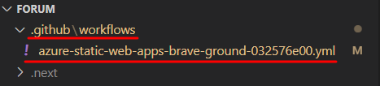
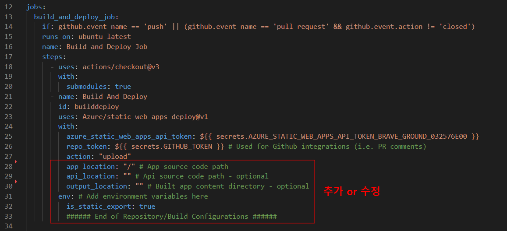
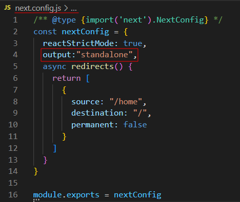

## 1. Azure로 Next.js 앱 배포하기

순서 1. **Azure 확장 창 열기 > F1 키로 명령 팔레트 열기 > Azure Static web Apps: Create Static Web App... 선택**


순서 2. 아래 설정과 값을 입력하여 Static Web App을 생성한다.

| **설정**       | 값                      |
| -------------- | ----------------------- |
| Name           | 원하는 앱의 이름 입력   |
| 지역           | East Asia               |
| 빌드 사전 설정 | Next.js (static export) |
| 앱 위치        | /                       |
| API 위치       | (이 상자를 비워 둠)     |
| 빌드 위치      | out                     |


## 2.  빌드에러 해결방법

### 에러_1: window is not defined in next.js react app 

- Next.js 에서 SSR을 할 때, window 나 document 전역 객체가 존재하지 않게 된다. 이러한 경우, window 객체의 로컬 스토리지에 접근하고 있기 때문에 undefined 참조 오류가 발생하는데, 아래와 같은 방법으로 회피할 수 있다.

#### typeof 연산자

```react
if (typeof window !== "undefined") {

}
```


#### useEffect Hook

- useEffect 는 렌더링 이후에 호출되기 때문에 오직 클라이언트 사이드에서만 동작하게 된다. useEffect 안에 코드를 작성하면 해결할 수 있다.

```react
useEffect(()=> {
	/** 여기서 window 혹은 document 객체에 접근하기 **/
}, [])
```


#### next/dynamic

- Next.js 는 ES2020 의 dynamic import 를 지원한다. ssr:false 옵션을 사용하면 SSR 없이 컴포넌트를 동적으로 불러올 수 있다.

```react
import dynamic from 'next/dynamic';

// 동적으로 서버사이드 렌더링
// dashboard > write > Editor 컴포넌트
const DynamicComponent = dynamic(() => import('./Editor'), {
    ssr: false,
})

const Edit = () => {
    return (
    	{
        	<DynamicComponent />
        }
    );
}
```


### 에러_2:  out 경로를 찾을 수 없다고 할 때

- Azure 에서 기본적으로 애플리케이션은 하이브리드 렌더링된 Next.js 애플리케이션으로 처리되지만 정적 사이트 생성기로 계속 사용하려면 배포 작업을 업데이트 해야한다.

순서 1. .github / workflows / ***.yml 파일을 연다.




순서 2. 환경 변수 is_static_export를 true로 추가하여 빌드 및 배포 작업으로 업데이트한다.




### 에러_3:  The content server has rejected the request with: BadRequest
Reason: The size of the function content was too large. The limit for this Static Web App is 104857600 bytes.

- 애플리케이션 크기가 100Mb를 초과하는 경우, standalone 기능을 사용하도록 next.config.js 에 다음 속성을 더 추가한다.




## 앞으로 연구해볼 것

1. 이미지를 저장할 Blob storage 만들기


## 참고문서

- [[Next.js] window is not defined - owen.dev.log](https://handhand.tistory.com/272)
- [Azure 가이드: 정적으로 생성된 Next.js](https://learn.microsoft.com/ko-kr/azure/static-web-apps/deploy-nextjs-static-export?tabs=github-actions)
- [Azure 가이드: 하이브리드 Next.js 애플리케이션](https://learn.microsoft.com/ko-kr/azure/static-web-apps/deploy-nextjs-hybrid)
