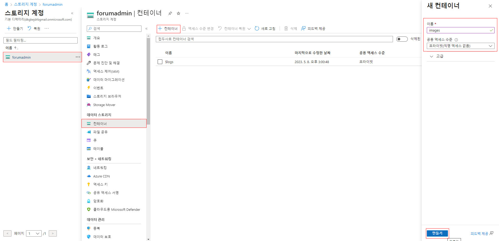

## 1. Azure Blob Storage 란?

- Blob Storage는 아래 목적에 맞게 사용하면 된다.

  - 브라우저에 이미지 또는 문서 직접 제공

  - 분산 액세스용 파일 저장

  - 비디오 및 오디오 스트리밍 등

    

- HTTP/HTTPS를 통해 Blob Storage의 개체에 액세스할 수 있다. Blob Storage의 개체는 Azure Storage REST API, Azure PowerShell, Azure CLI 또는 Azure Sotrage 클라이언트 라이브러리를 통해 액세스할 수 있다.


## 2. Blob Storage 리소스

- Blob Storage에서 제공하는 세 가지 종류의 리소스는 아래와 같다.

  - **스토리지 계정**
  - 스토리지 계정의 **컨테이너**
  - 컨테이너의 **Blob**

  

#### Storage 계정

스토리지 계정은 데이터에 대해 Azure에서 고유의 네임스페이스를 제공한다. 예를 들어, 스토리지 계정의 이름이 mystorageaccount인 경우 Blob Storage의 기본 엔드포인트는 다음과 같다.

```text
http://mystorageaccount.blob.core.windows.net
```


#### 컨테이너

컨테이너는 파일 시스템의 디렉터리(폴더)와 비슷한 Blob 세트를 구성한다. 한 스토리지 계정에 포함될 수 있는 컨테이너 수에 제한이 없으며, 컨테이너에 저장될 수 있는 Blob 수에도 제한이 없다. 예를 들어, 컨테어니의 URI는 아래와 같다.

```
https://myaccount.blob.core.windows.net/mycontainer
```


#### Blob

Azure Storage는 다음 세 가지 유형의 Blob을 지원한다.

- 블록 Blob: 텍스트 및 이진 데이터를 저장
- 추가 Blob: 블록 Blob과 같이 블록으로 구성되지만 추가 작업에 최적화
- 페이지 Blob


## 2. 스토리지 계정 만들기

순서 1. Azure 포털에 로그인


순서 2. 스토리지 계정 클릭


순서 3.+ 만들기 클릭 후, 아래와 같이 정보 기입


순서 4.검토 > 만들기 클릭하면, 아래와 같이 배포 완료 창이 확인됨.


## 3. 컨테이너 만들기

순서 1. 스토리지 계정 > 스토리지 계정 클릭 > 컨테이너 > + 컨테이너 클릭 > 새 컨테이너 > 이름 입력 > 만들기 클릭




순서 2. 컨테이너가 생성된다. 이 컨테이너는 디렉터리(폴더)로 이용할 수 있다.


## 4. 컨테이너에 Blob 데이터 업로드&다운로드하기

순서 1. 위에서 생성한 컨테이너를 클릭하여, 업로드 버튼을 통해 Blob 을 업로드할 수 있다.


순서 2. 업로드한 Blob 을 클릭하여 다운로드 or 삭제할 수 있다.


## 5. 프로젝트에 azure/storage-blob 패키지 설치

순서 1. 프로젝트에 Azure Storage npm 패키지를 설치한다.

```bash
npm install @azure/storage-blob
```


순서 2. 암호 없는 연결에 대한 Azure ID npm 패키지를 설치한다.

```bash
npm install @azure/identity
```


순서 3. 이 빠른 시작에 사용된 다른 종속성을 설치한다.

```bash
npm install uuid dotenv
```


## 6. Azure에 인증하고 Blob 데이터에 대한 액세스 권한 부여

- Azure AD 사용자 계정에 역할을 할당하는 방법과 DefaultAzureCredential을 사용하여 로그인하고 앱 코드를 Azure에 연결하는 방법이 있는데, 나는 DefaultAzureCredential을 사용하여 셋팅하겠다.

