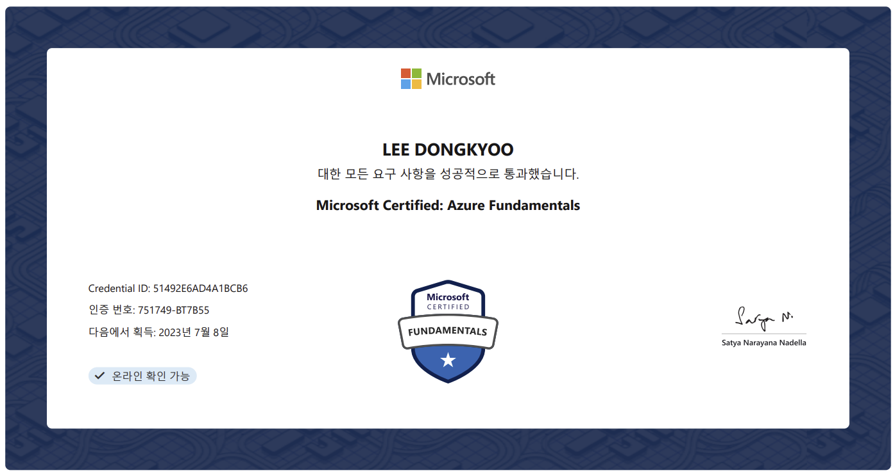

## 1. 공부방법

#### 1) Microsft 공식 문서 참고

- [Microsoft 인증 > 학습 가이드](https://learn.microsoft.com/ko-kr/certifications/resources/study-guides/AZ-900) 를 참고하여, 시험에 대한 정보, 측정 기술 등을 체크
  (※ Udemy의 해당 자격증의 강좌를 구매했지만, 도움이 되지 않을 것 같아 사용하지 않았다.)
- [자기주도적콘텐츠](https://learn.microsoft.com/ko-kr/users/sandramarin/collections/n6ga8m0jkgrwk) 를 기반으로, 모든 학습 모듈을 읽어보고 필요하다면 정리했다. 
  - Microsoft Azure 기본 사항: 클라우드 개념 설명
  - Azure 기본 사항: Azure 아키텍처 및 서비스 설명
  - Azure 기본 사항: Azure 관리 및 거버넌스 설명
- 자기주도적콘텐츠는 다음 단계로 넘어갈 때 마다, 점검지식이라는 미니 퀴즈가 있는데 학습내용을 정리하는데 도움이 되었다.
- [연습평가](https://learn.microsoft.com/ko-kr/certifications/exams/az-900/practice/assessment?assessment-type=practice&assessmentId=23) 를 3번 실시했다. 1번 실시할 때마다 50문항정도 나왔으며, 틀리거나 복습이 필요한 내용은 아래와 같이 오답노트를 만들어 기록해두었다.

------

##### [오답노트]

1. 클라우드 컴퓨팅의 장점 두가지

   - 고가용성

   - 지리적 분포

   - 확장성

2. 모든 클라우드 공갑자가 제공하는 두 가지 기본 서비스

   - 컴퓨팅

   - 저장

3. 퍼블릭 클라우드 배포 모델의 두가지 특징

   - 서비스는 인터넷을 통해 제공되며 구매를 원하는 모든 사람이 사용할 수 있음

   - 서버 및 스토리지는 타사 클라우드 서비스 공급자가 소유하고 운영함

4. 소비 기반 모델의 두 가지 특징

   - 선불 비용 없음

   - 더 이상 필요하지 않은 리소스에 대한 지불을 중지하는 기능

5. 가상 머신에 RAM 또는 CPU를 추가하여 앱의 컴퓨팅 용량을 늘리는 것
   - 수직 스케일링

6. 가상 머신과 같은 리소스 인스턴스를 추가하여 앱의 컴퓨팅 용량을 늘리는 것
   - 수평 스케일링

7. 클라우드 기반 백업 서비스, 데이터 복제 및 지리적 배포 기능
   - 재해 복구 계획

8. 애플리케이션이 고객 요구 사항을 충족하는 데 필요한 리소스를 갖도록 애플리케이션을 자동으로 확장
   - 탄력성

9. 클라우드 컴퓨팅에서 [답변]을 사용하면 전 세계 지역 데이터 센터에 애플리케이션을 배포
   - 지리적 위치

10. 애플리케이션을 실행하는 하드웨어를 가장 잘 제어할 수 있는 클라우드 서비스 모델
    - Iaas

11. ※PaaS(Platform as a Service) 모델에서 클라우드 서비스 공급자가 담당하는 두 가지 구성 요소
    - '운영 체제', '물리적 데이터 센터', '물리적 호스트 및 물리적 네트워크'를 담당

12. 일반적으로 월간 또는 연간 구독을 통해 라이선스가 부여되는 클라우드 서비스 모델 유형
    - SaaS는 귀하와 귀하의 사용자 또는 고객을 위해 중앙에서 호스팅되고 관리되는 소프트웨어입니다. 일반적으로 모든 고객이 한 가지 버전의 애플리케이션을 사용하며 월간 또는 연간 구독을 통해 라이선스가 부여
      반대로 Paas, Iaas는 종량제

13. ★ 고객이 운영 체제 관리를 담당하는 클라우드 서비스 모델
    - Iaas
      단, Paas, Saas 에서는 클라우드 공급자가 OS를 담당함

14. SaaS(Software as a Service) 모델에서 고객의 책임
    - 데이터 액세스

15. ★ 지역 쌍에서 지역은 동일한 [답변] 에서 다른 지역과 쌍을 이룹니다 .
    - geography(지리학), 최소 300마일 떨어진 미국, 유럽 또는 아시아와 같은 동일한 지역 내의 다른 지역과 쌍을 이룸

16. ★ 예를 들어 storage001이라는 Azure Storage 계정은 무엇입니까?
    - 자원. 가상 머신, 스토리지 계정, 웹앱, 데이터베이스 및 가상 네트워크는 리소스의 예

17. [정답]은 Azure용 배포 및 관리 서비스입니다.
    - ARM은 Azure용 배포 및 관리 서비스입니다. Azure 구독에서 리소스를 생성, 업데이트 및 삭제할 수 있는 관리 계층을 제공

18. 가상 프로세서, 메모리, 저장소 및 네트워킹 리소스를 포함하는 물리적 컴퓨터의 소프트웨어 에뮬레이션
    - 가상 머신

19. ★ 동일한 가상 머신 집합을 배포하고 관리하는 데 사용할 수 있는 Azure 컴퓨팅 서비스는 무엇인가요?
    - VM Scale Setes, 동일한 가상 머신 집합을 배포 및 관리하고 확장하는 데 사용할 수 있음

20. ★ VPN 게이트웨이의 사용 사례는 어떤 시나리오인가요?
    - 온-프레미스 데이터 센터를 Azure 가상 네트워크에 연결

21. 두 개의 다른 Azure 가상 네트워크에 있는 리소스가 서로 통신할 수 있도록 허용해야 합니다. 무엇을 구성해야 합니까?
    - 피어링

22. Azure SQL 데이터베이스와 같은 Azure 리소스를 Azure 가상 네트워크에 연결하기 위해 무엇을 사용할 수 있습니까?
    - 서비스 끝점, 서비스 끝점은 Azure 서비스를 가상 네트워크에 노출하는 데 사용되어 둘 사이의 통신을 제공
      (단, ExpressRoute는 온프레미스 네트워크를 Azure 연결하는데 사용. NSG는 가상 네트워크 및 가상 머신에 대한 인, 아웃바운드 규칙 구성)

23. ★ 컨테이너에서 애플리케이션을 실행할 수 있는 두 가지 서비스
    - Azure 컨테이너 인스턴스
    - AKS(Azure Kubernetes 서비스)

24. 스토리지 비용이 가장 높고 데이터 읽기 및 쓰기 액세스 시간이 가장 빠른 Azure Blob 스토리지 서비스 계층
    - Hot

25. ★ Azure 파일 공유에 액세스하는 데 사용되는 두 가지 프로토콜은 무엇인가요?
    - 네트워크 파일 시스템(NFS)
    - SMB(서버 메시지 블록)

26. ★ 심층 방어의 목적은 무엇입니까?
    - 여러 보호 계층을 사용하여 권한이 없는 사용자가 정보에 액세스하지 못하도록 방지

27. 사용자가 한 번 로그인하고 해당 자격 증명을 사용하여 다른 공급자의 여러 리소스 및 애플리케이션에 액세스할 수 있게 하는 것은 무엇입니까?
    - 싱글 사인온(SSO), Azure AD에서 등록 지원함.

28. ★ 사용자가 호환 장치에서만 애플리케이션에 액세스할 수 있도록 하려면 무엇을 사용할 수 있습니까?
    - 조건부 액세스, Azure AD가 사용 중인 장치와 같은 ID 신호를 기반으로 리소스에 대한 액세스를 허용하거나 거부하는 데 사용하는 도구입
      (단, 다단계인증(MFA)은 '로그인 프로세스' 중에 추가 형식의 식별을 위해 사용자에게 메시지를 표시하는 프로세스. 휴대폰의 코드 또는 지문 스캔 등이 예시
      하이브리드 ID 솔루션은 위치에 관계없이 모든 리소스에 대한 인증 및 권한 부여를 위한 공통 사용자 ID를 생성)

29. 데이터에 대한 무단 액세스를 목표로 하는 공격의 진행 속도를 늦추기 위해 일련의 메커니즘을 사용하는 전략 유형
    - 심층 방어

30. 사용자가 휴대폰을 사용하여 로그인해야 하는 보안 인증을 구성하는 데 사용할 수 있는 Azure AD 기능
    - 다단계 인증(MFA)

31. Azure AD에서 제공하는 두 가지 서비스는 무엇인가요?
    - 인증
    - 싱글 사인온(SSO)

32. ★ 사용자가 승인된 클라이언트 애플리케이션에서만 Microsoft Office 365 애플리케이션에 액세스할 수 있도록 하려면 어떤 Azure AD 기능을 사용할 수 있나요?
    - 조건부 액세스, 리자는 특정 신호를 기반으로 리소스에 대한 액세스를 제어, 허용 또는 거부할 수 있음

33. ★ 온-프레미스 AD DS(Active Directory Domain Services) 도메인에서 Azure AD로 ID를 동기화하는 데 무엇을 사용합니까?
    - Azure AD 연결, 온-프레미스 AD DS(Active Directory 도메인 서비스) 도메인의 사용자 ID를 Azure AD와 동기화하는데 사용
      (Azure AD 연결은 사용하면 두 시스템 모두에서 SSO(Single Sign-On), MFA 및 SSPR(셀프 서비스 암호 재설정)과 같은 기능을 사용할 수 있음)

34. 온-프레미스 데이터 센터에서 애플리케이션을 실행하는 비용과 Azure에서 애플리케이션을 실행하는 비용을 비교해야 합니다. 당신을 돕기 위해 무엇을 사용해야 합니까?
    - 총소유비용(TCO) 계산기

35. PaaS(Platform as a Service) 제품을 사용할 새 솔루션을 Azure에서 빌드할 계획입니다. 월 비용을 추정하기 위해 무엇을 사용해야 합니까?
    - Azure 가격 계산기, Azure 가격 계산기를 사용하면 특정 요구 사항에 따라 예측하고 구성할 수 있음

36. Azure Cost Management + Billing을 사용하여 사용할 수 있는 두 가지 기능은 무엇인가요?
    - 예산을 만들고 관리합니다.
    - 내역 보고서를 생성하고 향후 사용량을 예측합니다.

37. 매일 9시에서 17시 사이에만 액세스되는 Azure 가상 머신이 있습니다. 비용을 최소화하면서 관련 하드 디스크와 데이터를 보존하려면 어떻게 해야 합니까?
    - Deallocate(장비 정지)

38. 우발적인 삭제를 방지하기 위해 리소스에 적용할 수 있는 것은 무엇입니까?
    - 리소스 잠금

39. 신규 및 기존 Azure 리소스가 회사 표준을 준수하도록 하기 위해 무엇을 사용할 수 있습니까?
    - Azure Policy, 리소스를 제어하거나 감사하는 정책을 생성, 할당 및 관리할 수 있는 Azure의 서비스입니다. 이러한 정책은 구성이 회사 표준을 준수하도록 모든 리소스 구성에서 서로 다른 규칙을 적용

40. Azure 가상 머신 배포를 위한 솔루션을 권장해야 합니다. 솔루션은 가상 시스템에서 회사 표준을 적용해야 합니다. 추천서에 무엇을 포함해야 합니까?
    - Azure 정책, Azure VM Image Builder 및 Azure Compute Gallery와 결합할 때 새 가상 머신에서 회사 표준을 적용할 수 있습니다.

41. ★ 가상 머신의 배포를 특정 위치로 제한하기 위해 무엇을 사용할 수 있습니까?
    - Azure Policy, 가상 머신의 배포를 특정 위치로 제한할 수 있는 허용된 지역에 대한 정책을 만드는 데 도움
      (단, 리소스 잠금은 우발적인 사용을 예방하는 목적으로만 사용)

42. 선언적 JSON 형식으로 프로비저닝하려는 리소스를 정의하기 위해 무엇을 사용할 수 있습니까?
    - ARM 템플릿

43. ★ Android를 실행하는 모바일 장치에서 새 Azure 가상 머신을 만드는 데 사용할 수 있는 두 가지 도구는 무엇인가요? 
    - Azure Portal
    - Bash 및 PowerShell

44. A클라우드 플랫폼과 온프레미스 환경에서 서버를 관리하기 위해 무엇을 사용할 수 있습니까?
    - Azure Arc, 클라우드와 온프레미스 모두를 관리할 수 있음. 일관된 다중 클라우드 및 온-프레미스 관리 플랫폼을 제공하여 거버넌스 및 관리를 간소화

45. ★ Azure 리소스 비용을 줄이기 위한 권장 사항
    - Azure Advisor, 계정 사용량을 분석하고 설정 및 구성된 규칙을 기반으로 권장 사항을 만듭니다.

46. Azure에서 리소스를 관리해야 하는 Linux 관리자 팀이 있습니다. 팀은 Bash 셸을 사용하여 관리를 수행하려고 합니다.무엇을 추천해야 할까요?
    - Azure CLI, Linux 사용환경과 같은 Bash 셸을 사용하여 관리 작업을 수행할 수 있습니다. 

47. Azure 리소스를 평가하고 안정성, 보안, 성능 및 비용 절감을 개선하는 데 도움이 되는 권장 사항을 제공하는 Azure 서비스는 무엇인가요?
    - Azure Advisor, Azure 리소스를 평가하고 안정성, 보안 및 성능을 개선하고 운영 효율성을 달성하며 비용을 절감하는 데 도움이 되는 권장 사항을 제시합니다.

48. ★ 지난주에 발생한 서비스 중단에 대한 근본 원인 분석(RCA) 보고서를 검토해야 합니다. 보고서는 어디에서 찾아야 합니까?
    - Service Health, 이해 관계자와 공유할 수 있는 RCA(근본 원인 분석)라는 공식 사고 보고서를 제공합니다.

49. 가상 머신 사용률이 5분 동안 80%를 초과하는 경우 경고를 생성할 수 있는 Azure 서비스는 무엇인가요?
    - Azure Monitor, 메트릭을 기반으로 수집, 분석, 시각화 및 경고를 위한 플랫폼입니다. Azure Monitor는 전체 Azure 및 온-프레미스 환경에서 데이터를 기록할 수 있습니다.

50. ★ 조직에 중요한 Azure 서비스의 계획된 유지 관리에 대한 정보를 찾기 위해 무엇을 사용할 수 있나요?
    - Azure Service Health, 영향을 받는 서비스, 지역 및 세부 정보를 드릴다운하여 이벤트가 사용자에게 미치는 영향과 수행해야 하는 작업을 표시할 수 있습니다. 이러한 이벤트는 대부분 사용자에게 영향을 주지 않고 발생하며 표시되지 않습니다. 드문 경우지만 재부팅이 필요한 경우 Service Health를 사용하면 가동 중지 시간을 최소화하기 위해 유지 관리를 수행할 시기를 선택할 수 있습니다.

51. ★ 퍼블릭 클라우드 환경에서 고가용성은 무엇에 의존합니까?
    - SLA, 선택한 서비스 수준 계약 
      (단, 고가용성이란 계속 돌아가게 하는 것)

52. 클라우드 컴퓨팅에서 [답변]을 사용하면 전 세계 지역 데이터 센터에 애플리케이션을 배포할 수 있습니다.
    - 지리적 위치

53. ★ IaaS(Infrastructure as a Service) 클라우드 서비스 모델을 사용하는 것은 무엇입니까?
    - Azure 가상 머신, IaaS 제품입니다. 고객은 가상 머신의 구성과 모든 운영 체제 구성에 대한 책임이 있음.

54. ★ 리소스 태그에 대한 일반적인 청구 사용 사례인 두 가지 시나리오는 무엇입니까?
    - 태그를 사용하여 인적 자원, 마케팅 또는 재무와 같은 부서별로 또는 테스트 또는 생산과 같은 환경별로 비용을 분류할 수 있음.

55. ★ 리소스 위치를 변경하지 않고 리소스 비용을 조직 내의 다른 그룹에 연결해야 합니다. 무엇을 사용해야 합니까?
    - 리소스 태그, 프로덕션 환경에서 실행되는 가상 머신에 대한 청구 사용량과 같은 런타임 환경별로 청구 데이터를 그룹화하고 비용을 분류하는 데 사용할 수 있음.

56. ★ 귀하의 조직은 일년 내내 일관된 리소스 사용량을 갖는 여러 프로덕션 가상 머신을 배포할 계획입니다. 가상 머신의 기능을 줄이지 않고 가상 머신의 비용을 최소화하기 위해 무엇을 사용할 수 있습니까?
    - Azure Reservations, 예약 구매를 통해서 비용을 절감할 수 있는 것 같음. 특정 Azure 서비스에 대해 할인된 가격을 제공합니다. Azure Reservations는 종량제 가격에 비해 최대 72%를 절약할 수 있습니다.

57. ★ ISO 27001 정보 보안 관리 표준을 준수하는 Azure 서비스를 식별해야 합니다. 정보를 찾으려면 어디로 가야 합니까?
    - 마이크로소프트 보안 센터

58. ★ 임계값을 사용하여 자동 크기 조정 기능을 트리거하여 사용자 요구에 맞게 앱을 확장 또는 축소하는 사용자 지정 솔루션을 만들어야 합니다. 솔루션에 무엇을 포함해야 합니까?
    - Azure Monitor, CPU 백분율과 같은 메트릭 및 로깅 데이터를 수집하는 플랫폼입니다. 데이터는 자동 크기 조정을 트리거하는 데 사용할 수 있습니다.

59. 웹 앱의 성능 이상을 자동으로 감지하기 위해 무엇을 사용할 수 있습니까?
    - 애저 애플리케이션 인사이트

60. ★여러 구독에서 액세스, 정책 및 규정 준수를 관리하는 데 사용할 수 있는 리소스는 무엇인가요?
    - 관리 그룹
      (단, 리로스 그룹은 Azure 리소스를 구성하는데에만 사용)

61. Windows 기반 응용 프로그램을 실행할 Windows 환경에 대한 액세스 권한을 Mac 및 Android 사용자에게 제공하기 위해 무엇을 사용할 수 있습니까?
    - Azure 가상 데스크톱

62. ★Azure RBAC(역할 기반 액세스 제어) 역할이 적용되는 개체 또는 수준은 무엇인가요?
    - 범위, Azure RBAC 역할은 액세스가 적용되는 리소스 또는 리소스 집합인 범위에 적용

63. ★ 여러 개의 구독을 중첩 계층 구조로 관리하는 기능을 제공하는 Azure 도구
    - 관리 그룹

------

#### 2) Dump 문제 풀이

- 몇몇 시험 후기 블로그를 보니, Dump 문제가 시험에 대부분 나왔다고 하여 [ExamTopics](https://www.examtopics.com/exams/microsoft/az-900/)에서 기출문제를 풀어보았다. 
- 기출문제는 단순한 지식을 물어보는 것이 아니라 실무와 관련된 미션을 보여주고, 적절한 솔루션을 체크하는 객관식 문제였다. 이런 류의 문제 유형은 처음이라 당황했었다.

## 2. 시험후기

- Dump 문제에서 대부분 그대로 나왔으며, PearsonView 로 원격시험 공간과 자격을 인증했는데 처음에 애좀 먹었다.
- 이런 류의 시험에 대해 두려움이 있었는데, 기초 자격증이지만 합격하여 다음 발판으로 나아가는데 에너지가 되어준 것 같다.

