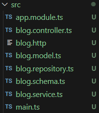

### NestJS로 웹 API 만들기

아래와 같이 교재에서 나오는 3단계로 블로그를 만든다.

| 1단계 API 만들기                                             | 2단계 의존성 주입                                            | 3단계 몽고DB 연동                                            |
| ------------------------------------------------------------ | ------------------------------------------------------------ | ------------------------------------------------------------ |
| 1. 프로젝트 생성하기<br />2. 컨트롤러 만들기<br />3. 블로그 API 작성하기<br />4. 메모리와 파일로 블로그 API 만들기 | 1. 의존성 주입 설정하기<br />2. 서비스에 리포지토리 의존성 주입하기<br />3. 컨트롤러에 서비스 의존성 주입하기 | 1. 의존성 설치하기<br />2. 스키마 만들기<br />3. 몽고DB 리포지토리 생성하기<br />4. 서비스에서 몽고DB를 사용하도록 변경하기 |


### 1. 프로젝트 생성과 설정

순서 1. nest-cli는 CLI 프로그램이므로 global 옵션을 사용해 어디서든지 사용하도록 설치

```bash
npm install -g @nestjs/cli
```


순서 2. 프로젝트 생성

```bash
// 방법 1. 이 명령어에 에러가 발생한다면, '방법 2' 로 실행
nest new blog 

// 방법 2
npx @nestjs/cli new blog
```


순서 3. blog 프로젝트 구조 확인

```
.
├─src
│      app.controller.spec.ts // 1. 컨트롤러
│      app.controller.ts // 2. 컨트롤러 테스트 코드
│      app.module.ts // 3. 모듈
│      app.service.ts // 4. 서비스
│      main.ts // 5. 서비스 메인 파일
.
```


1번, 3번. 컨트롤러, 컨트롤러 테스트 코드, 모듈을 각각 따로 만들어주는 것이 정석

2번. 컨트롤러 테스트를 위한 파일. NestJs는 jest와 supertest를 사용해 테스트

3번. main.ts는 익스프레스에서의 index.js와 같은 서버 기동 시의 시작 파일


순서 4. 프로젝트 실행

```
npm run start
```


### 2. 컨트롤러 만들기

컨트롤러는 유저가 보낸 HTTP 요청을 어떤 코드에서 처리할지 정하는 역할을 한다. HTTP 요청 시 헤더, URL 매개변수, 쿼리, 바디 등읜 정보가 있는데, 이 정보를 바탕으로 적절한 데코레이터가 붙어 있는 컨트롤러 코드를 실행시킨다.

익스프레스에서 자유롭게 만들었던 것과는 다르게, NestJS에서 컨트롤러는 **<모듈명>.controller.ts** 파일로 만든다.

------

순서 1. 디렉터리 파일 초기화

- 'main.ts' 와 'app.module.ts'를 제외하고 모두 삭제하고, 아래와 같이 모두 다시 만든다.




순서 2. 3개의 파일('app.module.ts', 'blog.controller.ts', 'blog.service.ts')의 코드르 아래와 같이 수정

```typescript
// blog > src > app.module.ts

import { Module } from "@nestjs/common";
import { BlogController } from "./blog.controller";
import { BlogService } from './blog.service';

@Module({
  imports: [],
  controllers: [BlogController],
  providers: [BlogService]
})
export class AppModule { }
```

```typescript
// blog > src > blog.controller.ts

export class BlogController { }
```

```typescript
// blog > src > blog.service.ts

export class BlogService { }
```


### 3. 블로그 API 작성하기

넵


### 참고

- [Node.js 백엔드 개발자 되기, 골든래빗, 박승규 지음](https://goldenrabbit.co.kr/product/be_node_backend/)


### 다음에 다루게 될 것

- NestJS로 블로그 API 만들기


