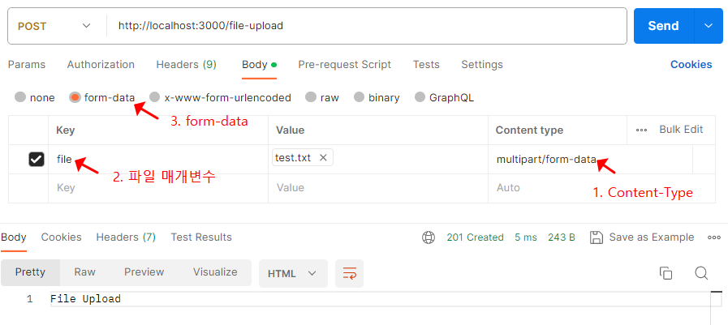
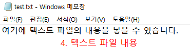
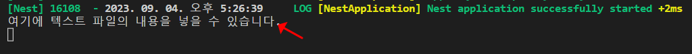

### 들어가기전에...

NextJS와 익스프레스, MongoDB로 이미지 업로드 API를 아주 라이트하게 만들어본적이 있는데, 상당히 고생했던 걸로 기억한다. 특히 Postman으로 파일 업로드 API를 테스트할 때, form-data 형식으로 key, value, contentType을 지정해줘야 하고, 서버에서 캐치할 때, form-data의 키로 레퍼런스가 된다든지 이런 것들을 아무것도 모르는 상태에서 공부하려니 무척 어려웠다. 그나마 지금은 약간 있는 내 지식을 채워 넣을 수 있는 기회라 기대가 된다. 그리고 정적 파일로 서비스하는 방법도 알아본다. 


------

### 1. 프로젝트 생성 및 의존성 설치하기

순서 1-1. nest-cli를 사용해 실습에 사용할 프로젝트를 생성

```bash
npx @nestjs/cli new nest-file-upload
```

------

순서 1-2. multer 패키지를 설치한다. multer는 파일 업로드에 사용되는 multipart/form-data를 다루는 Node.js 라이브러리이다. 

```bash
npm i -D @types/multer
```

------

### 2. 파일 업로드 API를 만들고 테스트하기

순서 2-1. 간단한 파일 업로드 API를 REST 클라이언트로 만들어보자. app.controller.ts 파일에 file-upload 핸들러 함수를 추가한다

```typescript
import { Controller, Get, Post, UploadedFile } from '@nestjs/common';
import { UseInterceptors } from '@nestjs/common/decorators';
import { AppService } from './app.service';
import { FileInterceptor } from '@nestjs/platform-express';

@Controller()
export class AppController {
  constructor(private readonly appService: AppService) {}

  ... 생략 ...
  @Post('file-upload') // 1. POST 메서드로 localhost:3000/file-upload 호출 시 동작
  @UseInterceptors(FileInterceptor('file')) // 2. 파일 인터셉터
  // 3. 인터셉터에서 준 파일을 받음
  fileUpload(@UploadedFile() file: Express.Multer.File) {
    console.log(file.buffer.toString('utf-8')); // 4. 텍스트 파일 내용 출력
    return 'File Upload';
  }
}

```

1번. 파일 업로드는 POST 메서드로만 가능하며, Content-Type을 multipart/form-data로 해야한다

2번. 인터셉터(@UseInterceptors(FileInterceptor())는 클라이언트와 서버 간의 요청과 응답 간에 로직을 추가하는 미들웨어이다. FileIntercepter()는 클라이언트의 요청에 따라 파일명이 file인 파일이 있는지 확인한다.


3번. @UploadedFile() 데코레이터는 핸들러 함수의 매개변수 데코레이터이다. 인수로 넘겨진 값 중 file 객체를 지정해 꺼내는 역할을 한다. 여러 파일을 업로드할 때 사용하는 @UploadedFiles() 데코레이터도 있다. 각 파일의 타입은 Express.Multer.File 타입이다.

4번. (설명 생략)

------

순서 2-2. Postman으로 테스트





1번. Content-Type은 multipart/form-data로 설정한다. **파일과 각종 데이터를 동시에 보낼 때 사용한다**

2~3번. form-data로 key의 이름을 file로 value에는 파일을 업로드한다

4번. 파일에 저장한 텍스트이다




### 정리

- 액세스 토큰은 리소스 서버에서 리소스 소유자의 보호된 정보를 획득할 때 사용하는 만료 기간이 있는 토큰
- 리프레시 토큰을 사용해 인가 서버에서 새로운 액세스 토큰을 발급받아야 한다. 선택적으로 리프레시 토큰도 재발급받을 수 있다.


### 참고

- [Node.js 백엔드 개발자 되기, 골든래빗, 박승규 지음](https://goldenrabbit.co.kr/product/be_node_backend/)


### 다음에 다루게 될 것

- 파일 업로드 기능 구현하기

