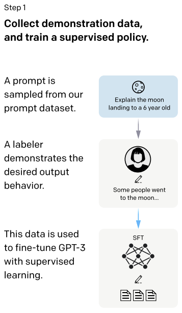

## 1. 논문 정보

- 제목: Training language models to follow instructions with human feedback
- 저자: *Long Ouyang* et al
- doi: **[ arXiv:2203.02155](https://arxiv.org/abs/2203.02155)**

----

## 2. 요약

 언어 모델의 크기를 늘린다고 해서 사용자 친화적 모델이 되는 것은 아니다. 예를 들어, 대규모 언어 모델(LLM)은 거짓이나 유해 피드백, 또는 사용자에게 도움이 되지 않는 피드백을 생성할 수 있다. 이 논문에서는 인간 피드백을 활용한 파인 튜닝을 통해 언어 모델을 다양한 작업에 대해 사용자 의도와 일치시키는 방법, 즉 InstructGPT를 제안한다.

 먼저 스크린 테스트를 통해 선발된 40명의 라벨러가 Supervised Fine Tuning(SFT)에 필요한 데모 데이터를 생성하거나 모델이 생성한 응답을 평가하는 역할을 맡는다. 이후 GPT-3를 다음과 같은 세 단계로 훈련한다.

    

---

## 3. 결론

 본 연구에서는 두 가지 대규모 연구를 통해 GPT-4를 활용한 파이프라인으로 생성된 피드백의 품질을 평가하였다. 첫 번째로 GPT-4가 생성한 피드백을 Nature 계열 논문 3,096편과 ICLR 논문 1,709편의 인간 평가자의 피드백과 비교 분석하였다. GPT-4와 인간 평가자 간의 평균 일치율은 Nature 저널에서 30.85%, ICLR에서 39.23로 나타났으며, 이는 두 명의 인간 평가자 간 일치율(Nature: 28.58%, ICLR: 35.25%)과 유사한 수준이었다. 특히, 거부된 ICLR 논문에서는 GPT-4와 인간 평가자 간의 평균 일치율이 43.80%로, 더 높은 일치율을 보였다.

 마지막으로, AI 및 컴퓨터 생물학 분야의 미국 내 110개 기관의 308명 연구자들을 대상으로 한 연구에서, 연구자들은 자신의 논문에 대한 GPT-4 시스템의 피드백을 어떻게 받아들이는지 평가하였다. 전체적으로, 사용자의 절반 이상(57.4%)이 GPT-4가 생성한 피드백을 유용하거나 매우 유용하다고 평가했으며, 82.4%는 적어도 일부 인간 평가자의 피드백보다 더 유익하다고 생각했다. 그러나 GPT-4는 특정 과학적 피드백 측면(예: ‘더 많은 데이터셋에 대한 실험 추가’)에 집중하는 경향이 있으며, 방법론 설계에 대한 심층적인 비판을 제공하는 데 어려움을 겪는 것으로 나타났다.

---

## 4. 느낀점

 본 논문을 연구하며 GPT-4 기반의 자동화 파이프라인을 통해 유용한 피드백을 생성하는 과정을 깊이 이해할 수 있었습니다. 제 연구 계획에서 초등학생 학습자가 작성한 연구 문서에 대해 GPT-4 모델을 파인 튜닝하여 피드백을 제공하는 것만으로는 한계가 있음을 깨달았습니다. 하지만 본 논문에서 제시된 파이프라인의 두 번째 단계, 즉 LLM과 인간이 작성한 피드백에서 중요한 포인트를 추출해 텍스트 요약을 수행하고, 이를 의미론적 텍스트 매칭을 통해 비교하는 방식은 매우 효과적인 피드백 생성 방법으로 보입니다.

 그러나 실제 파이프라인의 소스코드를 분석해본 결과, 첫 번째 단계는 구현되어 있었지만, 유용한 피드백을 제공하기 위한 두 번째 단계의 코드는 존재하지 않음을 확인했습니다. 논문의 저자가 의도적으로 코드를 공유했든, 공유하지 않았든 간에, 완전한 자동화를 구현한 코드를 직접 테스트해볼 수 없다는 점이 아쉬웠습니다.

 하지만 본 논문을 통해 얻은 아이디어는 매우 유용하며, 이를 실현하기 위해 회사로부터 초등학생 학습자가 작성한 연구 문서의 데이터베이스에 접근할 계획입니다. 데이터베이스의 레이블과 값들을 통해 파인 튜닝을 위한 전처리 단계를 어떻게 진행할지 계획을 세워야 할 것입니다. 이 과정은 GPT-4를 활용한 자동화된 피드백 시스템을 개발하는 데 있어 중요한 초석이 될 것입니다. 이를 통해 어린 학습자들이 작성한 문서에 대한 효율적이고 정확한 피드백을 제공하는 데 한 걸음 더 다가갈 수 있을 것으로 기대합니다.